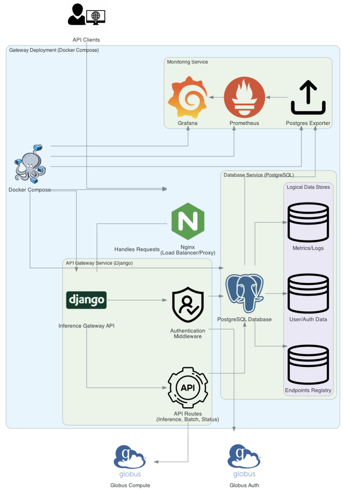

[](https://opensource.org/licenses/Apache-2.0)


# Inference Gateway for FIRST toolkit

FIRST (Federated Inference Resource Scheduling Toolkit) is a system that enables LLM (Large Language Model) inference as a service, allowing secure, remote execution of LLMs through an [OpenAI](https://platform.openai.com/docs/overview)-compatible API. FIRST's Inference Gateway is a RESTful API that validates and authorizes inference requests to scientific computing clusters using [Globus Auth](https://www.globus.org/globus-auth-service) and [Globus Compute](https://www.globus.org/compute).

## Table of Contents

- [System Architecture](#system-architecture)
- [Prerequisites](#prerequisites)
- [Setup Overview](#setup-overview)
- [Gateway Setup](#gateway-setup)
  - [Installation (Docker or Bare Metal)](#installation-docker-or-bare-metal)
  - [Register Globus Application](#register-globus-application)
  - [Configure Environment (.env)](#configure-environment-env)
  - [Initialize Gateway Database](#initialize-gateway-database)
- [Inference Backend Setup (Remote/Local)](#inference-backend-setup-remotelocal)
  - [Create Virtual Environment](#virtual-python-environment)
  - [Install Inference Server (e.g., vLLM) and Globus Compute](#install-inference-server-eg-vllm-and-globus-compute)
  - [Register Globus Compute Functions](#register-globus-compute-functions)
  - [Configure and Start a Globus Compute Endpoint](#configure-and-start-a-globus-compute-endpoint)
- [Connecting Gateway and Backend](#connecting-gateway-and-backend)
  - [Update Fixtures](#update-fixtures)
  - [Load Fixtures](#load-fixtures)
- [Starting the Services](#starting-the-services)
  - [Gateway (Docker or Bare Metal)](#gateway-docker-or-bare-metal)
  - [Inference Backend (Globus Compute Endpoint)](#inference-backend-globus-compute-endpoint)
- [Verifying the Setup](#verifying-the-setup)
- [Production Considerations (Nginx)](#production-considerations-nginx)
- [Monitoring](#monitoring)
- [Troubleshooting](#troubleshooting)

## System Architecture



The Inference Gateway consists of several components:
- **API Gateway**: [Django](https://www.djangoproject.com/)-based [REST](https://www.django-rest-framework.org/)/[Ninja](https://django-ninja.dev/) API that handles authorization and request routing.
- **Globus Auth**: Authentication and authorization service.
- **Globus Compute Endpoints**: Remote execution framework on HPC clusters (or local machines).
- **Inference Server Backend**: (e.g., [vLLM](https://docs.vllm.ai/en/latest/)) High-performance inference service for LLMs running alongside the Globus Compute Endpoint.

## Prerequisites

- [Python](https://www.python.org/) 3.11+
- [PostgreSQL](https://www.postgresql.org/docs/) Server (included in the Docker deployment)
- [Poetry](https://python-poetry.org/docs/#installation)
- [Docker](https://docs.docker.com/) and [Docker Compose](https://docs.docker.com/compose/) (Recommended for Gateway deployment)
- [Globus Account](https://www.globus.org/)
- Access to a compute resource (HPC cluster or a local machine with sufficient resources for the chosen inference server and models)

## Setup Overview

The setup involves two main parts:
1.  **Gateway Setup**: Installing and configuring the central API gateway service.
2.  **Inference Backend Setup**: Setting up the inference server (like vLLM) and the Globus Compute components on the machine(s) where models will run.

These parts can be done in parallel, but configuration details from each are needed to link them.

## Gateway Setup

This section covers setting up the central Django application.

### Installation (Docker or Bare Metal)

Clone the repository first:
```bash
git clone https://github.com/auroraGPT-ANL/inference-gateway.git
cd inference-gateway
```

**Option 1: Docker Deployment (Recommended)**

```bash
# Create necessary directories needed by docker-compose.yml
mkdir -p logs prometheus
# Create a basic prometheus config if you don't have one
# echo "global:\n  scrape_interval: 15s\nscrape_configs:\n  - job_name: 'prometheus'\n    static_configs:\n      - targets: ['localhost:9090']" > prometheus/prometheus.yml

# Configuration is done via the .env file (see next steps)
```
*See [Starting the Services](#starting-the-services) for how to run this after configuration.* 
*See `docker-compose.yml` for details on included services (Postgres, Redis, optional monitoring).* 

**Option 2: Bare Metal Setup / Local Development (need a PostgreSQL server)**

```bash
# Set up Python environment with Poetry
poetry config virtualenvs.in-project true
poetry env use python3.11
poetry install

# Activate the environment
poetry shell
# Can also use 'source .venv/bin/activate'

# Ensure PostgreSQL server is running and accessible.
# Configuration is done via the .env file (see next steps)
```

### Register Two Globus Applications

**Service API Application**

To handle authorization within the API, the Gateway needs to be registered as a Globus Service API application:

1.  Visit [developers.globus.org](https://app.globus.org/settings/developers) and sign in.
2.  Under **Register an...**, click on **Register a service API ...**.
3.  Select **none of the above - create a new project** or select one of your existing projects.
4.  Complete the new project form (not needed if you selected an existing project).
5.  Complete the registration form:
    *   Set **App Name** (e.g., "My Inference Gateway").
    *   Add **Redirect URIs**. For local development with the default Django server (`runserver`), use `http://localhost:8000/complete/globus/`. For production, use `https://<your-gateway-domain>/complete/globus/`.
    *   You can leave the check boxes to their default setting.
    *   Set **Privacy Policy** and **Terms & Conditions** URLs if applicable.
6.  After registration, a **Client UUID** will be assigned to your Globus application. Generate a **Client Secret** by clicking on the **Add Client Secret** button on the right-hand side. **You will need both for the `.env` configuration.** The UUID will be for `GLOBUS_APPLICATION_ID`, and the secret will be for `GLOBUS_APPLICATION_SECRET`.

**Add a Globus Scope to your Service API Application**

A scope is needed for users to generate an access token to access the inference service. First export the API client credentials in a terminal:
```bash
export CLIENT_ID="<Your-Gateway-Service-API-Globus-App-Client-UUID>"
export CLIENT_SECRET="<Your-Gateway-Service-API-Globus-App-Client-Secret>"
```

Make a request to Globus Auth to attach an `action_all` scope to your API client. The `curl` command below will also embed a dependent Globus Group scope to the main scope, which is needed for the API to query the user's Group memberships during the authorization process.
```bash
curl -X POST -s --user $CLIENT_ID:$CLIENT_SECRET \
    https://auth.globus.org/v2/api/clients/$CLIENT_ID/scopes \
     -H "Content-Type: application/json" \
     -d '{
            "scope": {
                "name": "Action Provider - all",
                "description": "Access to inference service.",
                "scope_suffix": "action_all",
                "dependent_scopes": [
                    {
                        "scope": "73320ffe-4cb4-4b25-a0a3-83d53d59ce4f",
                        "optional": false,
                        "requires_refresh_token": true
                    }
                ]
            }
         }'
```

To verify that the scope was successfully created, query the details of your API client, and look for the UUID in the `scopes` field:
```bash
curl -s --user $CLIENT_ID:$CLIENT_SECRET https://auth.globus.org/v2/api/clients/$CLIENT_ID
```

Query the details of your newly created scope (you shoud see `73320ffe-4cb4-4b25-a0a3-83d53d59ce4f` in the `dependent_scopes` field):
```bash
export SCOPE_ID="<copy-paste-your-scope-uuid-here>"
curl -s --user $CLIENT_ID:$CLIENT_SECRET https://auth.globus.org/v2/api/clients/$CLIENT_ID/scopes/$SCOPE_ID
```

**Service Account Application**

To handle the communication between the Gateway API and the compute resources (the Inference Backend), you need to create a Globus **Service Account application**. This application represents the Globus identity that will own the Globus Compute endpoints.

1.  Visit [developers.globus.org](https://app.globus.org/settings/developers) and sign in.
2.  Under **Projects**, click on project used to register your Service API application from the previous step.
3.  Click on **Add an App**.
4.  Select **Register a service account ...**.
5.  Complete the registration form:
    *   Set **App Name** (e.g., "My Inference Endpoints").
    *   Set **Privacy Policy** and **Terms & Conditions** URLs if applicable.
6.  After registration, a **Client UUID** will be assigned to your Globus application. Generate a **Client Secret** by clicking on the **Add Client Secret** button on the right-hand side. **You will need both for the `.env` configuration.** The UUID will be for `POLARIS_ENDPOINT_ID`, and the secret will be for `POLARIS_ENDPOINT_SECRET`.

### Configure Environment (.env)

Create a `.env` file in the project root (`inference-gateway/`). This file is used by both Docker and bare-metal setups (if using `python-dotenv`).

```dotenv
# --- Core Django Settings ---
SECRET_KEY="<generate-a-strong-random-key>" # Can be generate with Django, e.g. python -c 'from django.core.management.utils import get_random_secret_key; print(get_random_secret_key())'
DEBUG=True # Set to False for production
ALLOWED_HOSTS="localhost,127.0.0.1" # Add your gateway domain/IP for production

# --- Globus Credentials (from the "Register Globus Application" step) ---
# Client ID and Secret of the Globus Service API application
GLOBUS_APPLICATION_ID="<Your-Gateway-Service-API-Globus-App-Client-UUID>"
GLOBUS_APPLICATION_SECRET="<Your-Gateway-Service-API-Globus-App-Client-Secret>"
# Optional: Restrict access to specific Globus Groups (space-separated UUIDs)
# GLOBUS_GROUPS="<group-uuid-1> <group-uuid-2>"
# Optional: Enforce specific Identity Provider usage (JSON string)
# AUTHORIZED_IDPS='{"Your Institution": "your-institution-uuid"}'
# Optional: Enforce Globus high assurance policies (space-separated UUIDs)
# GLOBUS_POLICIES="<policy-uuid-1>"
# Client ID and Secret of the Globus Service Account application
POLARIS_ENDPOINT_ID="<Your-Service-Account-Globus-App-Client-UUID>"
POLARIS_ENDPOINT_SECRET="<Your-Service-Account-Globus-App-Client-Secret>"

# --- CLI Authentication Helper ---
# Public Client ID used by the inference-auth-token.py script for user authentication
CLI_AUTH_CLIENT_ID="58fdd3bc-e1c3-4ce5-80ea-8d6b87cfb944" # Default public client, replace if needed
# Optional: Comma-separated list of allowed domains for CLI login (e.g., "anl.gov,alcf.anl.gov")
# CLI_ALLOWED_DOMAINS="anl.gov,alcf.anl.gov"
# Optional: Override token storage directory for CLI script
# CLI_TOKEN_DIR="~/.globus/my_custom_token_dir"
# Optional: Override App Name used by CLI script
# CLI_APP_NAME="my_custom_cli_app"


# --- Database Credentials ---
# Used by Django Gateway, Postgres container, postgres-exporter
POSTGRES_DB="inferencegateway"
POSTGRES_USER="inferencedev"
POSTGRES_PASSWORD="inferencedevpwd" # CHANGE THIS for production
# Hostname: Use "postgres" for Docker-compose networking.
# Use "localhost" for bare-metal if DB is local.
# Use "host.docker.internal" if Gateway runs in Docker but DB runs on the host machine.
PGHOST="postgres" # Important: Use "postgres" for Docker
PGPORT=5432
PGUSER="dataportaldev"
PGPASSWORD="inferencedevpwd" # CHANGE THIS for production
PGDATABASE="inferencegateway"

# --- Redis --- Used for caching, async tasks
# Use "redis" for Docker-compose networking.
# Use "localhost" (or relevant hostname) for bare-metal.
REDIS_URL="redis://redis:6379/0"

# --- Gateway Specific Settings ---
MAX_BATCHES_PER_USER=2 # Max concurrent batch jobs allowed per user

# --- Optional: Grafana Admin Credentials (for Docker setup) ---
# GF_SECURITY_ADMIN_USER=admin
# GF_SECURITY_ADMIN_PASSWORD=admin

# QSTAT ENDPOINTS
# SOPHIA_QSTAT_ENDPOINT_UUID=""
# SOPHIA_QSTAT_FUNCTION_UUID=""
```

**Important**: Securely store all of your credentials and secrets, especially in production. The `CLI_AUTH_CLIENT_ID` is typically a public client and doesn't need to be kept secret.

### Initialize Gateway Database

Once you have configured the `.env` file, initialize the Gateway's database schame.

**Option 1: Docker (also works with Podman)**

First, build and run the Gateway's containers (there should be 7 in total):

```bash
docker-compose -f docker-compose.yml up -d
```

Initialize the database:
```bash
docker-compose -f docker-compose.yml exec inference-gateway python manage.py makemigrations
docker-compose -f docker-compose.yml exec inference-gateway python manage.py migrate
```

**Option 2: Bare Metal**

If you are not using Docker, you must have a PostgreSQL service running.
```bash
# Ensure DB connection vars are exported in your shell or use python-dotenv
# (e.g., export PGHOST=localhost POSTGRES_USER=...)
python manage.py makemigrations
python manage.py migrate
```

## Inference Backend Setup (Remote/Local)

This section covers setting up the components on the machine where the AI models will actually run (e.g., an HPC compute node, a powerful workstation).

### Virtual Python Environment

All of the instruction below must be done within a Python virtual environment. Make sure to use a **virtual environment with the same Python version as the one used to deploy Gateway API** (Python 3.11 in this example). This will avoid version mismatch errors when using Globus Compute.

### Install Inference Server (e.g., vLLM) and Globus Compute

Choose and install an inference serving framework. vLLM is recommended for performance with many transformer models:

```bash
# Create and activate a Python virtual environment (recommended)
python -m venv vllm-env
source vllm-env/bin/activate  # On Windows use `vllm-env\Scripts\activate`

# Basic vLLM installation from source
git clone https://github.com/vllm-project/vllm.git
cd vllm
pip install -e .
# For specific hardware acceleration (CUDA, ROCm), follow official docs:
# https://docs.vllm.ai/en/latest/getting_started/installation.html
```

Install the Globus Compute Endpoint software and the Globus Compute SDK:
```bash
pip install globus-compute-sdk globus-compute-endpoint
```

### Register Globus Compute Functions

The Gateway interacts with the inference server via functions registered with Globus Compute. You need to register:

1.  **Inference Function**: Wraps the call to your inference server (e.g., vLLM OpenAI-compatible endpoint).
2.  **Status Function (Optional but Recommended)**: Queries the cluster scheduler (e.g., PBS `qstat`) and node status to aid federated routing.

**Important:** When registering Globus Compute functions and endpoints, you need to explicitly tie the function/endpoint identity back to your Globus **Service Account** application (not the Service API application). Do this by exporting the client ID (value of `POLARIS_ENDPOINT_ID` in `.env`) and Secret (value of `POLARIS_ENDPOINT_SECRET` in `.env`) as environment variables, **before** running the registration script or configuring the endpoint:
```bash
export GLOBUS_COMPUTE_CLIENT_ID="<Value-of-POLARIS_ENDPOINT_ID-from-.env>"
export GLOBUS_COMPUTE_CLIENT_SECRET="<Value-of-POLARIS_ENDPOINT_SECRET-from-.env>"
```

Now, register the necessary functions:

```bash
# Ensure you are in the correct Python environment

# Navigate to the `compute-functions` directory in your local clone of the repository.
cd path/to/inference-gateway/compute-functions

# Register the vLLM inference function (modify the script if needed)
# See compute-functions/vllm_register_function.py
python vllm_register_function.py
# Note the output Function UUID (e.g., <vllm-function-uuid>)
# Output example:
#   Function registered with UUID - ....
#   The UUID is stored in vllm_register_function_sophia_multiple_models.txt.

# Register the qstat/status function (modify script for your scheduler if needed)
python qstat_register_function.py
# Note the output Function UUID (e.g., <qstat-function-uuid>)

# (Register other functions like batch processing if needed)
```

**Important**: Keep track of the Function UUIDs generated.

### Configure and Start a Globus Compute Endpoint

This endpoint runs on the backend machine, listens for tasks from Globus Compute, and executes the registered functions.

```bash
# Ensure you are in the correct Python environment

# Configure a new endpoint (follow prompts)
# Here we use "my-compute-endpoint" for the name but you can choose another name (e.g. local-vllm)
globus-compute-endpoint configure my-compute-endpoint

# This creates a configuration directory, e.g., ~/.globus_compute/my-compute-endpoint/
# Edit the config.yaml inside that directory.
```

# Note on HPC Configuration Examples:
See [`local-vllm-endpoint.yaml`](./compute-endpoints/local-vllm-endpoint.yaml) for a configuration example that submits tasks on local hardware. For an example of submitting inference tasks through a cluster scheduler like PBS (specifically on ALCF's Sophia cluster), see [`sophia-vllm-config-template-v2.0.yaml`](./compute-endpoints/sophia-villm-config-template-v2.0.yaml). Adapting cluster examples requires understanding the specific HPC environment (scheduler, modules, file paths, etc.).
Refer to [Globus Compute Endpoint Docs](https://globus-compute.readthedocs.io/en/latest/endpoints.html) for all options.

If you adopted the above configuration examples, make sure to edit the following:

*  `allowed_functions`: Make sure the function UUIDs (one per line) are the ones you registered in the [Register Globus Compute Functions](#register-globus-compute-functions) section.
* `worker_init`: *Note:* For local setups, you'll typically activate your environment directly (e.g., `source vllm-env/bin/activate`). For cluster setups like the Sophia example, you might use a shared setup script (e.g., `source <my-path>inference-gateway/compute-endpoints/common_setup.sh`). Ensure you point to the correct setup script or activation command for your environment.

**After configuring `config.yaml`:**

```bash
# Start the endpoint
globus-compute-endpoint start my-compute-endpoint

# Note the Endpoint UUID displayed after starting.
# You can always recover the UUID by typing `globus-compute-endpoint list`
```

**Keep track of the Endpoint UUID.**

## Connecting Gateway and Backend

### Update Fixtures

Edit the relevant fixtures file in the Gateway project directory (`inference-gateway/fixtures/`).

For federated access, edit `federated_endpoints.json`.

**Example: `fixtures/federated_endpoints.json`**

```json
[
    {
        "model": "resource_server.federatedendpoint",
        "pk": 1,
        "fields": {
            "name": "OPT 125M (Federated)",
            "slug": "federated-opt-125m",
            "target_model_name": "facebook/opt-125m", // Model users request
            "description": "Federated access point for the facebook/opt-125m model.",
            "targets": [
                {
                    "cluster": "local",
                    "framework": "vllm",
                    "model": "facebook/opt-125m", // Model served by this specific target
                    "endpoint_slug": "local-vllm-facebook-opt-125m", // Unique ID for this target
                    "endpoint_uuid": "<local-endpoint-UUID-from-previous-step>",
                    "function_uuid": "<local-vllm-function-uuid-from-previous-step>",
                    "api_port": 8001 // Port your local vLLM server runs on
                }
                // Add more targets here for the same model on different clusters/frameworks
                // Example: A target on an HPC cluster like Sophia
                // {
                //    "cluster": "sophia",
                //    "framework": "vllm",
                //    "model": "facebook/opt-125m", // Assuming OPT-125m is also deployed there
                //    "endpoint_slug": "sophia-vllm-facebook-opt-125m",
                //    "endpoint_uuid": "<sophia-endpoint-UUID>",
                //    "function_uuid": "<sophia-vllm-function-UUID>",
                //    "api_port": 8000 // Port on Sophia's compute node
                // }
            ]
        }
    }
    // Add more FederatedEndpoint entries for other models
]
```

For standard, non-federated access, edit `endpoints.json`.

**Example: `fixtures/endpoints.json`**

```json
[
    {
        "model": "resource_server.endpoint",
        "pk": 1, // Or next available primary key
        "fields": {
            "endpoint_slug": "local-vllm-facebook-opt-125m", // Example for local OPT-125m
            "cluster": "local", // Or wherever your compute endpoint is hosted
            "framework": "vllm",
            "model": "facebook/opt-125m", // Model served by this endpoint
            "api_port": 8001, // Example port for local vLLM server
            "endpoint_uuid": "<local-endpoint-uuid-from-previous-step>",
            "function_uuid": "<local-vllm-function-uuid-from-previous-step>",
            "batch_endpoint_uuid": "<optional-endpoint-for-batch>",
            "batch_function_uuid": "<optional-function-for-batch>",
            "allowed_globus_groups": "" // Optional: Restrict this target further
        }
    }
    // Add more Endpoint entries for other models/clusters
]
```

Replace placeholders (`<...>`) with the UUIDs and details from the previous steps.

### Load Fixtures

Load the updated fixture file into the Gateway database.

**Option 1: Docker:**

Make sure the fixture `json` files are updated within the running container. You can do this by editing the files directly within the container:
```bash
docker-compose -f docker-compose.yml exec inference-gateway /bin/bash
# The edit the /app/fixtures/endpoints.json (or federated_endpoints.json) file
```

or by transfering the edited local file directly into the container:
```bash
docker cp fixtures/endpoints.json inference-gateway_inference-gateway_1:/app/fixtures/
# Or: docker cp fixtures/federated_endpoints.json inference-gateway_inference-gateway_1:/app/fixtures/
```

Load the fixtures into the database:
```bash
docker-compose -f docker-compose.yml exec inference-gateway python manage.py loaddata fixtures/endpoints.json
# Or: docker-compose ... exec inference-gateway python manage.py loaddata fixtures/federated_endpoints.json
```

**Option 2: Bare Metal:**
```bash
python manage.py loaddata fixtures/endpoints.json
# Or: python manage.py loaddata fixtures/federated_endpoints.json
```

## Starting the Services

### Gateway (Docker or Bare Metal)

**Docker:**
```bash
# Start all services defined in docker-compose.yml (if not already running)
docker-compose -f docker-compose.yml up --build -d
```

**Bare Metal (Development):**
```bash
# Ensure DB connection vars are set
poetry shell
python manage.py runserver 0.0.0.0:8000 # Or your preferred port
```

**Bare Metal (Production with Gunicorn):**
```bash
# Ensure environment variables are set
poetry shell
poetry run gunicorn \
    inference_gateway.asgi:application \
    -k uvicorn.workers.UvicornWorker \
    -b 0.0.0.0:8000 \
    --workers 5 \
    --log-level info
    # Add other Gunicorn flags as needed (--threads, --timeout, log files etc.)
```

### Inference Backend (Globus Compute Endpoint)

Ensure the Globus Compute endpoint is running on the backend machine:

```bash
# On the HPC login node / backend machine
globus-compute-endpoint start <my-endpoint-name>
```

Verify the associated inference server (e.g., vLLM) is started by the endpoint's worker initialization or job submission process.

## Verifying the Setup

Once both the Gateway and at least one Backend Compute Endpoint (with its inference server) are running, you can send a test request. You'll need a valid Globus authentication token obtained for the gateway's scope.

1.  **Get a Token using the Helper Script**:
    *   Ensure your `.env` file has `GLOBUS_APPLICATION_ID` (for the gateway) and `CLI_AUTH_CLIENT_ID` (for the helper script, a default public one is provided) set. You also need to configure `CLI_ALLOWED_DOMAINS` to target your specific identity provider (e.g. your institution's SSO). By default, without specifying `CLI_ALLOWED_DOMAINS`, the only allowed providers are `anl.gov` and `alcf.anl.gov`.
    *   **Authenticate (First time or if tokens expire):** Run the authentication script. This will open a browser window for Globus login.
        ```bash
        python inference-auth-token.py authenticate
        ```
        This stores refresh and access tokens locally (typically in `~/.globus/app/...`).
    *   **Force Re-authentication:** If you need to change Globus accounts or encounter permission errors possibly related to expired sessions or policy changes, log out via [https://app.globus.org/logout](https://app.globus.org/logout) and force re-authentication:
        ```bash
        python inference-auth-token.py authenticate --force
        ```
    *   **Get Access Token:** Retrieve your current, valid access token:
        ```bash
        export MY_TOKEN=$(python inference-auth-token.py get_access_token)
        echo "Token stored in MY_TOKEN environment variable."
        # echo $MY_TOKEN # Uncomment to view the token directly
        ```
        This command automatically uses the stored refresh token to get a new access token if the current one is expired.

    *   **Token Validity:** Access tokens are valid for 48 hours. Refresh tokens allow getting new access tokens without re-logging in via browser, but they expire after 6 months of inactivity. Some institutions or policies might enforce re-authentication more frequently (e.g., weekly).


2.  **Send Request using cURL**: You can adjust the model name and payload as appropriate.

    Example with a standard, non-federated Globus Compute endpoint (assuming `endpoints.json` was used):

    ```bash
    # Example targeting a specific vLLM endpoint on the 'local' cluster for OPT-125m
    curl -X POST http://127.0.0.1:8000/resource_server/local/vllm/v1/chat/completions \\
          -H "Authorization: Bearer $MY_TOKEN" \\
          -H "Content-Type: application/json" \\
          -d '{
            "model": "facebook/opt-125m",
            "messages": [
              {"role": "user", "content": "Explain the concept of Globus Compute in simple terms."}
            ],
            "max_tokens": 150
          }'
    ```

    Example with a federated Globus Compute endpoint (assuming `federated_endpoints.json` was used):

    ```bash
    # Example using the federated endpoint for OPT-125m
    curl -X POST http://127.0.0.1:8000/resource_server/v1/chat/completions \\
          -H "Authorization: Bearer $MY_TOKEN" \\
          -H "Content-Type: application/json" \\
          -d '{
            "model": "facebook/opt-125m",
            "messages": [
              {"role": "user", "content": "Explain the concept of Globus Compute in simple terms."}
            ],
            "max_tokens": 150
          }'
    ```

A successful response will be a JSON object containing the model's completion.

## Production Considerations (Nginx)

For production deployments (especially bare-metal), running Django/Gunicorn behind a reverse proxy like Nginx is highly recommended for:

*   **HTTPS/SSL Termination**: Securely handle TLS encryption.
*   **Load Balancing**: Distribute requests across multiple Gunicorn workers/instances.
*   **Serving Static Files**: Efficiently serve CSS, JS, images.
*   **Security**: Add rate limiting, header checks, etc.
*   **Hostname Routing**: Direct traffic based on domain names.

**Example Nginx Configuration Snippet (`/etc/nginx/sites-available/inference_gateway`):**

```nginx
upstream app_server {
    # fail_timeout=0 means we always retry an upstream even if it failed
    # to return a good HTTP response (in case the Gunicorn worker recovers).
    server 127.0.0.1:8000 fail_timeout=0;
    # Add more servers here if running multiple Gunicorn instances
}

server {
    listen 80;
    # listen 443 ssl;
    server_name your-gateway-domain.org;

    # ssl_certificate /path/to/your/cert.pem;
    # ssl_certificate_key /path/to/your/key.pem;

    client_max_body_size 4G;

    location /static/ {
        alias /path/to/inference-gateway/static/;
    }

    location / {
        proxy_set_header X-Forwarded-For $proxy_add_x_forwarded_for;
        proxy_set_header X-Forwarded-Proto $scheme;
        proxy_set_header Host $http_host;
        proxy_redirect off;
        proxy_pass http://app_server;
    }
}
```

*Remember to collect static files (`python manage.py collectstatic`) and configure Nginx to serve them from the specified `alias` path.* 
*Consult Nginx documentation for details on SSL setup and other options.*

## Monitoring

Access the monitoring dashboard (if deployed via Docker Compose with monitoring enabled):

- **Grafana**: http://localhost:3000 (default credentials: admin/admin) - Visualizes metrics.
- **Prometheus**: http://localhost:9090 - Collects metrics.

The Grafana dashboard includes:
- Application metrics (request rates, latency, error rates)
- System metrics (CPU, memory, disk I/O via Node Exporter)
- Database metrics (connection counts, query performance via PostgreSQL Exporter)
- Custom Gateway metrics (inference rates, token counts - requires metrics endpoint in Gateway)

## Troubleshooting

*   **Docker Nginx 404/502/504 Errors:** Verify `nginx_app.conf` mount and upstream definition, check `inference-gateway` logs.
*   **Database Connection Errors:** Check `.env` variables (`PGHOST`, etc.) match context (Docker vs. Host vs. Bare-metal) and firewall/`pg_hba.conf` rules.
*   **Globus Auth Errors**: Ensure Redirect URIs match in Globus Developer portal and `.env` credentials are correct.
*   **Compute Endpoint Issues**: Check endpoint logs (`~/.globus_compute/<endpoint_name>/endpoint.log`) for function execution errors, environment problems, or connection issues.
*   **500 Server Errors on Gateway**: Check gateway logs (`docker-compose logs inference-gateway` or Gunicorn log files) for Python tracebacks.
