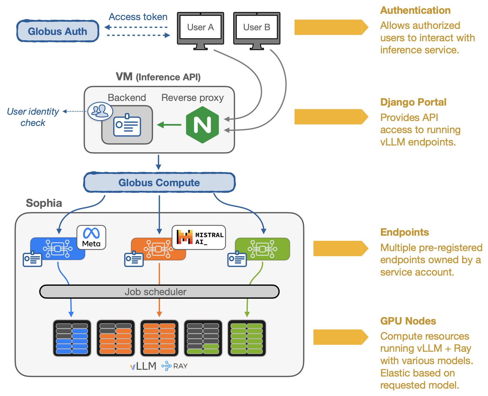

[](https://opensource.org/licenses/Apache-2.0)


# Inference Gateway for FIRST Toolkit

FIRST (Federated Inference Resource Scheduling Toolkit) is a system that enables LLM (Large Language Model) inference as a service, allowing secure, remote execution of LLMs through an [OpenAI](https://platform.openai.com/docs/overview)-compatible API. FIRST's Inference Gateway is a RESTful API that validates and authorizes inference requests to scientific computing clusters using [Globus Auth](https://www.globus.org/globus-auth-service) and [Globus Compute](https://www.globus.org/compute).

## System Architecture



The Inference Gateway consists of several components:
- **API Gateway**: [Django](https://www.djangoproject.com/)-based [REST](https://www.django-rest-framework.org/)/[Ninja](https://django-ninja.dev/) API that handles authorization and request routing.
- **Globus Auth**: Authentication and authorization service.
- **Globus Compute Endpoints**: Remote execution framework on HPC clusters (or local machines).
- **Inference Server Backend**: (e.g., [vLLM](https://docs.vllm.ai/en/latest/)) High-performance inference service for LLMs running alongside the Globus Compute Endpoint.

## Documentation

📚 **Complete documentation is available at: [https://auroragpt-anl.github.io/inference-gateway/](https://auroragpt-anl.github.io/inference-gateway/)**

### Quick Links

- **[Administrator Guide](https://auroragpt-anl.github.io/inference-gateway/admin-guide/)** - Setup and deployment instructions
  - [Docker Deployment](https://auroragpt-anl.github.io/inference-gateway/admin-guide/gateway-setup/docker/)
  - [Bare Metal Setup](https://auroragpt-anl.github.io/inference-gateway/admin-guide/gateway-setup/bare-metal/)
  - [Inference Backend Setup](https://auroragpt-anl.github.io/inference-gateway/admin-guide/inference-setup/)
  
- **[User Guide](https://auroragpt-anl.github.io/inference-gateway/user-guide/)** - How to use the inference API

- **[Example Deployment](https://github.com/argonne-lcf/inference-endpoints)** - ALCF production deployment

## Citation

If you use ALCF Inference Endpoints or the Federated Inference Resource Scheduling Toolkit (FIRST) in your research or workflows, please cite our paper:

```bibtex
@inproceedings{10.1145/3731599.3767346,
  author = {Tanikanti, Aditya and C\^{o}t\'{e}, Benoit and Guo, Yanfei and Chen, Le and Saint, Nickolaus and Chard, Ryan and Raffenetti, Ken and Thakur, Rajeev and Uram, Thomas and Foster, Ian and Papka, Michael E. and Vishwanath, Venkatram},
  title = {FIRST: Federated Inference Resource Scheduling Toolkit for Scientific AI Model Access},
  year = {2025},
  isbn = {9798400718717},
  publisher = {Association for Computing Machinery},
  address = {New York, NY, USA},
  url = {https://doi.org/10.1145/3731599.3767346},
  doi = {10.1145/3731599.3767346},
  abstract = {We present the Federated Inference Resource Scheduling Toolkit (FIRST), a framework enabling Inference-as-a-Service across distributed High-Performance Computing (HPC) clusters. FIRST provides cloud-like access to diverse AI models, like Large Language Models (LLMs), on existing HPC infrastructure. Leveraging Globus Auth and Globus Compute, the system allows researchers to run parallel inference workloads via an OpenAI-compliant API on private, secure environments. This cluster-agnostic API allows requests to be distributed across federated clusters, targeting numerous hosted models. FIRST supports multiple inference backends (e.g., vLLM), auto-scales resources, maintains "hot" nodes for low-latency execution, and offers both high-throughput batch and interactive modes. The framework addresses the growing demand for private, secure, and scalable AI inference in scientific workflows, allowing researchers to generate billions of tokens daily on-premises without relying on commercial cloud infrastructure.},
  booktitle = {Proceedings of the SC '25 Workshops of the International Conference for High Performance Computing, Networking, Storage and Analysis},
  pages = {52–60},
  numpages = {9},
  keywords = {Inference as a Service, High Performance Computing, Job Schedulers, Large Language Models, Globus, Scientific Computing},
  series = {SC Workshops '25}
}
```

## Acknowledgements

This work was supported by the U.S. Department of Energy, Office of Science, Office of Advanced Scientific Computing Research, under Contract No. DE-AC02-06CH11357. This research used resources of the Argonne Leadership Computing Facility, which is a DOE Office of Science User Facility.

## License

This project is licensed under the Apache License 2.0 - see the [LICENSE](LICENSE) file for details.
