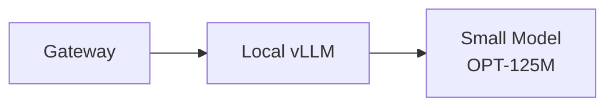
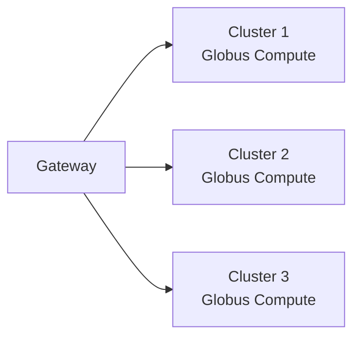

# Administrator Guide

Welcome to the FIRST Inference Gateway Administrator Guide. This guide will help you deploy and configure the gateway for your organization.

## Overview

Setting up FIRST involves two main components:

1. **Globus Setup**: The applications and clients that communicate with Globus services
2. **Gateway Setup**: The central API service that handles authentication and routing
3. **Inference Backend Setup**: The actual inference servers where models run

These can be deployed independently and connected together through configuration.

## Prerequisites

Before you begin, ensure you have:

- Python 3.12 or later
- Docker and Docker Compose (for Docker deployment)
- PostgreSQL Server (or use Docker)
- Globus Account
- Access to compute resources (for inference backends)

## Globus Applications

Globus applications are required to operate the service and manage the authentication and authorization layer. 

[Globus Guide →](gateway-setup/globus-setup.md)

## Deployment Architecture

Choose your deployment approach:

### Gateway Deployment Options

**Docker Deployment (Recommended)**

- Quick setup with Docker Compose
- **Pros**: Easy to deploy, includes all dependencies, portable
- **Cons**: Requires Docker knowledge
- **[Docker Guide →](gateway-setup/docker.md)**

**Bare Metal Deployment**

- Direct installation on your server infrastructure
- **Pros**: More control, better performance, easier debugging
- **Cons**: Manual dependency management
- **[Bare Metal Guide →](gateway-setup/bare-metal.md)**

### Inference Backend Options

**Globus Compute + vLLM** _(Recommended for Production)_

- Deploy vLLM on HPC clusters with Globus Compute for remote execution
- **Best for**: Multi-cluster, federated deployments, HPC environments
- **[Globus Compute Setup →](inference-setup/globus-compute.md)**

**Local vLLM**

- Run vLLM inference server locally without Globus Compute
- **Best for**: Single-node deployments, development
- **[Local vLLM Setup →](inference-setup/local-vllm.md)**

**Direct API Connection**

- Connect to existing OpenAI-compatible APIs (OpenAI, Anthropic, etc.)
- **Best for**: Simple setup, using commercial APIs
- **[Direct API Setup →](inference-setup/direct-api.md)**

## Setup Workflow

### Phase 1: Gateway Setup

1. Choose your deployment method (Docker or Bare Metal)
2. Register Globus applications
3. Configure environment variables
4. Initialize the database
5. Start the gateway service

### Phase 2: Inference Backend Setup

1. Choose your backend type
2. Install required software (vLLM, Globus Compute, etc.)
3. Configure the backend
4. Register endpoints/functions
5. Test the connection

### Phase 3: Connect Gateway and Backend

1. Update fixture files with backend details
2. Load fixtures into the gateway database
3. Verify end-to-end functionality

## Common Patterns

### Pattern 1: Quick Local Development

**Use**: Development and testing

**Setup Time**: ~15 minutes

**Resources**: 1 GPU or CPU

### Pattern 2: Production Single Cluster

**Use**: Production deployment on single HPC cluster

**Setup Time**: ~2 hours

**Resources**: HPC cluster access

### Pattern 3: Federated Multi-Cluster

**Use**: Maximum availability and resource pooling

**Setup Time**: ~4 hours

**Resources**: Multiple HPC clusters

## Next Steps

Ready to get started? Choose your path:

- **Quick Start**: [Docker Deployment](gateway-setup/docker.md)
- **Full Setup**: [Bare Metal Deployment](gateway-setup/bare-metal.md)
- **Backend Setup**: [Inference Backend Overview](inference-setup/index.md)

## Production Examples

### ALCF Sophia Cluster

We provide production-ready examples from our deployment at **Argonne Leadership Computing Facility (ALCF)** Sophia cluster:

- **Modular launcher scripts** with automatic Ray setup for multi-node models
- **Environment management** with dynamic version selection
- **Production configurations** for single-node and multi-node deployments (up to 405B parameter models)
- **Advanced features**: chunked prefill, prefix caching, tool calling

These examples are located in `compute-endpoints/` and `compute-functions/` directories and should be adapted for your specific HPC environment.

!!! example "See ALCF Examples"
    View the complete ALCF Sophia production setup in the [Globus Compute Guide](inference-setup/globus-compute.md#alcf-sophia-production-example) including:
    
    - `sophia_env_setup_with_ray.sh` - Environment and Ray cluster management
    - `launch_vllm_model.sh` - Flexible vLLM launcher with multi-node support
    - Example YAML configurations for various model sizes

## Additional Resources

- [Configuration Reference](gateway-setup/configuration.md)
- [Production Best Practices](deployment/production.md)
- [Monitoring & Troubleshooting](monitoring.md)
- [Kubernetes Deployment](deployment/kubernetes.md) (Coming Soon)

