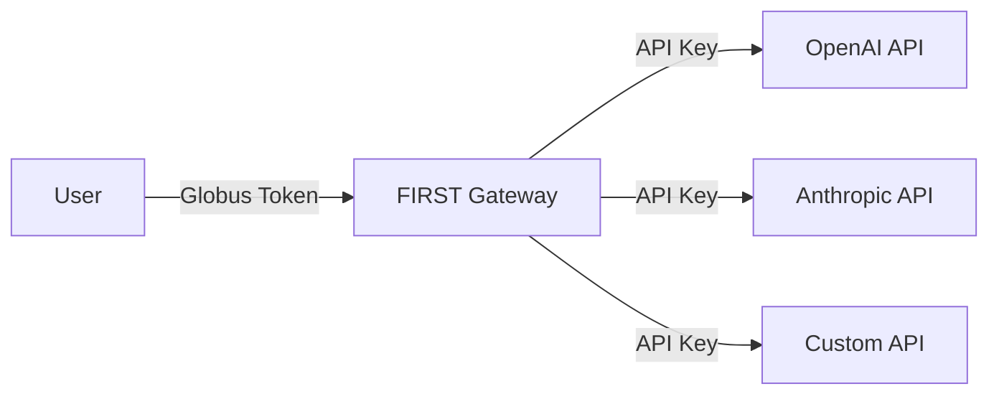

# Direct API Connection

This guide shows you how to connect the FIRST Gateway to existing OpenAI-compatible APIs without running any local inference infrastructure.

## Overview

The Direct API backend allows you to:

- Proxy requests to commercial APIs (OpenAI, Anthropic, etc.)
- Add Globus authentication to existing APIs
- Manage API keys centrally
- Route between multiple API providers

## Architecture



## Prerequisites

- FIRST Gateway deployed and running
- API keys from your providers
- A way to host a status manifest (static file or endpoint)

## Step 1: Create Status Manifest

The gateway uses a status manifest to discover available endpoints. Create a JSON file:

```json
{
  "openai-gpt4": {
    "status": "Live",
    "model": "OpenAI GPT-4",
    "description": "GPT-4 models via OpenAI API",
    "experts": [
      "gpt-4",
      "gpt-4-turbo",
      "gpt-4o",
      "gpt-4o-mini"
    ],
    "url": "https://api.openai.com/v1",
    "endpoint_id": "openai-production"
  },
  "anthropic-claude": {
    "status": "Live",
    "model": "Anthropic Claude",
    "description": "Claude models via Anthropic API",
    "experts": [
      "claude-3-opus-20240229",
      "claude-3-sonnet-20240229",
      "claude-3-haiku-20240307"
    ],
    "url": "https://api.anthropic.com/v1",
    "endpoint_id": "anthropic-production"
  }
}
```

### Manifest Field Descriptions

| Field | Required | Description |
|-------|----------|-------------|
| `status` | Yes | "Live", "Offline", or "Maintenance" |
| `model` | Yes | Human-readable model description |
| `description` | Yes | Detailed description |
| `experts` | Yes | Array of model identifiers |
| `url` | Yes | Base URL for the API |
| `endpoint_id` | Yes | Unique identifier (used for API key mapping) |

## Step 2: Host the Status Manifest

### Option A: Static File Server

```bash
# Simple Python HTTP server
mkdir -p /var/www/metis
cp status.json /var/www/metis/
cd /var/www/metis
python3 -m http.server 8055
```

### Option B: Nginx

```nginx
server {
    listen 80;
    server_name status.yourdomain.com;
    
    location / {
        root /var/www/metis;
        add_header Content-Type application/json;
        add_header Access-Control-Allow-Origin *;
    }
}
```

### Option C: S3/Cloud Storage

Upload `status.json` to a public S3 bucket or equivalent:

```bash
# AWS S3
aws s3 cp status.json s3://your-bucket/status.json --acl public-read

# Access via: https://your-bucket.s3.amazonaws.com/status.json
```

### Option D: Local for Docker (Development Only)

For local Docker testing:

```bash
# On host machine
mkdir -p deploy/docker/examples
cat > deploy/docker/examples/metis-status.json << 'EOF'
{
  "openai-gateway": {
    "status": "Live",
    "model": "OpenAI Pass-through",
    "description": "Routes to OpenAI's GPT models",
    "experts": ["gpt-4o-mini", "gpt-4"],
    "url": "https://api.openai.com/v1",
    "endpoint_id": "openai-production"
  }
}
EOF

# Serve it
python3 -m http.server 8055 --directory deploy/docker/examples
```

Then use `http://host.docker.internal:8055/metis-status.json` in your Docker `.env`.

## Step 3: Configure Gateway

Add these to your gateway's `.env` file:

```dotenv
# URL to your status manifest
METIS_STATUS_URL="http://your-server:8055/status.json"

# API keys mapped to endpoint_id from the manifest
METIS_API_TOKENS='{"openai-production": "sk-proj-...", "anthropic-production": "sk-ant-..."}'
```

### Environment Variable Format

**METIS_STATUS_URL**: Direct URL to your JSON manifest

**METIS_API_TOKENS**: JSON object where:

- Keys are `endpoint_id` values from your manifest
- Values are the API keys for those services

Example with multiple providers:

```dotenv
METIS_API_TOKENS='{
  "openai-production": "sk-proj-abc123...",
  "anthropic-production": "sk-ant-xyz789...",
  "custom-api": "custom-key-here"
}'
```

## Step 4: Restart Gateway

### Docker

```bash
docker-compose up -d inference-gateway
```

### Bare Metal

```bash
sudo systemctl restart inference-gateway
```

## Step 5: Test the Connection

Get a Globus token:

```bash
export TOKEN=$(python inference-auth-token.py get_access_token)
```

Test OpenAI endpoint:

```bash
curl -X POST http://localhost:8000/resource_server/metis/api/v1/chat/completions \
  -H "Authorization: Bearer $TOKEN" \
  -H "Content-Type: application/json" \
  -d '{
    "model": "gpt-4o-mini",
    "messages": [{"role": "user", "content": "Hello from FIRST!"}],
    "stream": false
  }'
```

Expected response:

```json
{
  "id": "chatcmpl-...",
  "object": "chat.completion",
  "created": 1234567890,
  "model": "gpt-4o-mini",
  "choices": [{
    "index": 0,
    "message": {
      "role": "assistant",
      "content": "Hello! How can I assist you today?"
    },
    "finish_reason": "stop"
  }],
  "usage": {
    "prompt_tokens": 10,
    "completion_tokens": 15,
    "total_tokens": 25
  }
}
```

## Advanced Configuration

### Multiple Endpoints Per Provider

```json
{
  "openai-us-east": {
    "status": "Live",
    "model": "OpenAI US East",
    "experts": ["gpt-4"],
    "url": "https://api.openai.com/v1",
    "endpoint_id": "openai-us-east"
  },
  "openai-eu-west": {
    "status": "Live",
    "model": "OpenAI EU West",
    "experts": ["gpt-4"],
    "url": "https://api.openai.com/v1",
    "endpoint_id": "openai-eu-west"
  }
}
```

### Custom API Headers

For APIs requiring additional headers, you can extend the gateway code or use environment variables. Contact your administrator for custom integration.

### Load Balancing

The gateway automatically load-balances across all "Live" endpoints for the same model.

### Failover

If one endpoint returns an error, the gateway automatically tries the next available endpoint.

## Monitoring

### Check Endpoint Status

The gateway periodically fetches the status manifest. View logs:

```bash
# Docker
docker-compose logs -f inference-gateway | grep metis

# Bare metal
tail -f logs/django_info.log | grep metis
```

### Track API Usage

Monitor usage through:

- Gateway access logs
- Provider API dashboards (OpenAI, Anthropic)
- Custom usage tracking (implement in gateway)

## Cost Management

### Setting Budgets

Configure per-user or per-group budgets in your application logic or via API key restrictions at the provider level.

### Rate Limiting

The gateway supports rate limiting per user/group. Configure in Django admin or via settings.

## Security Considerations

### API Key Security

!!! danger "Protect Your API Keys"
    - Never commit API keys to version control
    - Use environment variables or secrets management
    - Rotate keys regularly
    - Use separate keys for dev/staging/production

### Status Manifest Security

If your manifest contains sensitive information:

- Serve over HTTPS
- Implement authentication (basic auth, token)
- Restrict IP access via firewall

### Access Control

Restrict which Globus groups can access which APIs:

```dotenv
GLOBUS_GROUPS="allowed-group-uuid-1 allowed-group-uuid-2"
```

## Troubleshooting

### Gateway can't fetch status manifest

Check connectivity:

```bash
curl http://your-server:8055/status.json
```

Verify `METIS_STATUS_URL` is correct and accessible from the gateway.

### Authentication errors from provider

- Verify API key is correct
- Check key hasn't expired
- Ensure key has required permissions
- Check provider status page

### Model not found

Ensure the model name matches exactly what's in the `experts` array of your manifest.

### Rate limiting errors

- Check provider rate limits
- Implement gateway-side rate limiting
- Consider upgrading provider plan

## Example: Adding Azure OpenAI

```json
{
  "azure-openai": {
    "status": "Live",
    "model": "Azure OpenAI",
    "description": "GPT models via Azure OpenAI Service",
    "experts": [
      "gpt-4",
      "gpt-35-turbo"
    ],
    "url": "https://your-resource.openai.azure.com/openai/deployments/your-deployment",
    "endpoint_id": "azure-openai-prod"
  }
}
```

Azure requires additional configuration - consult Azure OpenAI documentation.

## Next Steps

- [User Guide](../../user-guide/index.md) - How to use the API
- [Monitoring](../monitoring.md) - Set up monitoring and alerts
- [Local vLLM](local-vllm.md) - Add local inference capabilities
- [Production Best Practices](../deployment/production.md)

## Additional Resources

- [OpenAI API Documentation](https://platform.openai.com/docs/api-reference)
- [Anthropic API Documentation](https://docs.anthropic.com/claude/reference)
- [Gateway Configuration Reference](../gateway-setup/configuration.md)

