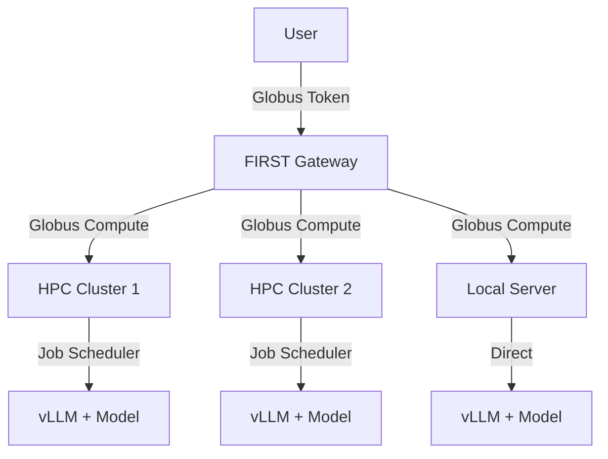

# Globus Compute + vLLM Setup

This guide shows you how to deploy vLLM on HPC clusters or remote servers using Globus Compute for federated inference.

## Overview

This is the recommended approach for:

- Multi-cluster federated deployments
- HPC environments with job schedulers (PBS, Slurm)
- Organizations requiring high availability
- Remote execution with secure authentication

## Architecture



## Prerequisites

- FIRST Gateway deployed with Service Account application credentials
- Access to compute resources (HPC cluster or powerful workstation)
- GPU resources for running models
- Python 3.12+ (same version as gateway)
- Globus Compute SDK and Endpoint software

## Part 1: Setup on Compute Resource

This is done on the machine(s) where models will run.

### Step 1: Create Python Environment

!!! warning "Version Match"
    Use the **same Python version** as your gateway to avoid compatibility issues.

```bash
# Using conda (recommended for HPC)
conda create -n vllm-env python=3.12 -y
conda activate vllm-env

# OR using venv
python3.12 -m venv vllm-env
source vllm-env/bin/activate
```

### Step 2: Install vLLM

```bash
# For CUDA 12.1 (default)
pip install vllm

# For specific CUDA version
pip install vllm-cu118  # CUDA 11.8

# From source (for latest features)
git clone https://github.com/vllm-project/vllm.git
cd vllm
pip install -e .
```

### Step 3: Install Globus Compute

```bash
pip install globus-compute-sdk globus-compute-endpoint
```

### Step 4: Export Service Account Credentials

These are from your Gateway's Service Account application:

```bash
export GLOBUS_COMPUTE_CLIENT_ID="<SERVICE_ACCOUNT_ID-from-gateway-.env>"
export GLOBUS_COMPUTE_CLIENT_SECRET="<SERVICE_ACCOUNT_SECRET-from-gateway-.env>"
```

Add to your `~/.bashrc` or `~/.bash_profile` for persistence:

```bash
echo 'export GLOBUS_COMPUTE_CLIENT_ID="your-id"' >> ~/.bashrc
echo 'export GLOBUS_COMPUTE_CLIENT_SECRET="your-secret"' >> ~/.bashrc
```

### Step 5: Register Globus Compute Functions

Navigate to the gateway repository's compute-functions directory:

```bash
cd /path/to/inference-gateway/compute-functions
```

#### Register Inference Function

```bash
python vllm_register_function_with_streaming.py
```

Output:

```
Function registered with UUID: 12345678-1234-1234-1234-123456789abc
The UUID is stored in vllm_register_function_streaming.txt
```

**Save this Function UUID** - you'll need it later.

#### Register Status Function (Optional but Recommended)

For HPC clusters with job schedulers:

```bash
python qstat_register_function.py
```

Save the Function UUID from the output.

#### Register Batch Function (Optional)

For batch processing support:

```bash
python vllm_batch_function.py
```

Save the Function UUID.

### Step 6: Configure Globus Compute Endpoint

Create a new endpoint:

```bash
globus-compute-endpoint configure my-inference-endpoint
```

This creates `~/.globus_compute/my-inference-endpoint/config.yaml`.

#### For Local/Workstation Deployment

Edit `config.yaml`:

```yaml
display_name: My Inference Endpoint
engine:
  type: GlobusComputeEngine
  provider:
    type: LocalProvider
    init_blocks: 1
    max_blocks: 1
    min_blocks: 0

# Allow only your registered functions
allowed_functions:
  - 12345678-1234-1234-1234-123456789abc  # Your vLLM function UUID
  - 87654321-4321-4321-4321-cba987654321  # Your qstat function UUID (if any)

# Activate your environment before running functions
worker_init: |
  source /path/to/vllm-env/bin/activate
  # OR: conda activate vllm-env
```

#### For HPC with PBS (e.g., ALCF Sophia)

```yaml
display_name: Sophia vLLM Endpoint
engine:
  type: GlobusComputeEngine
  provider:
    type: PBSProProvider
    account: YourProjectAccount
    queue: demand
    nodes_per_block: 1
    init_blocks: 1
    max_blocks: 4
    min_blocks: 0
    walltime: "06:00:00"
    scheduler_options: |
      #PBS -l filesystems=home:eagle
      #PBS -l place=scatter
    worker_init: |
      module load conda
      conda activate /path/to/vllm-env
      # OR: source /path/to/common_setup.sh

# GPU allocation
max_workers_per_node: 1

# Allow only your registered functions
allowed_functions:
  - 12345678-1234-1234-1234-123456789abc
```

#### For HPC with Slurm

```yaml
display_name: Slurm vLLM Endpoint
engine:
  type: GlobusComputeEngine
  provider:
    type: SlurmProvider
    account: your_account
    partition: gpu
    nodes_per_block: 1
    init_blocks: 1
    max_blocks: 4
    walltime: "06:00:00"
    scheduler_options: |
      #SBATCH --gpus-per-node=1
      #SBATCH --mem=64G
    worker_init: |
      source /path/to/vllm-env/bin/activate

allowed_functions:
  - 12345678-1234-1234-1234-123456789abc
```

### Step 7: Start the Endpoint

```bash
globus-compute-endpoint start my-inference-endpoint
```

Output:

```
Starting endpoint; registered ID: abcdef12-3456-7890-abcd-ef1234567890
```

**Save this Endpoint UUID** - you'll need it for gateway configuration.

Verify it's running:

```bash
globus-compute-endpoint list
```

View logs:

```bash
globus-compute-endpoint log my-inference-endpoint
```

## Part 2: Configure Gateway

Now configure the gateway to use your Globus Compute endpoint.

### Step 1: Create Endpoint Fixture

On your gateway machine, edit `fixtures/endpoints.json`:

#### Single Endpoint Configuration

```json
[
    {
        "model": "resource_server.endpoint",
        "pk": 1,
        "fields": {
            "endpoint_slug": "sophia-vllm-llama3-8b",
            "cluster": "sophia",
            "framework": "vllm",
            "model": "meta-llama/Meta-Llama-3-8B-Instruct",
            "api_port": 8000,
            "endpoint_uuid": "abcdef12-3456-7890-abcd-ef1234567890",
            "function_uuid": "12345678-1234-1234-1234-123456789abc",
            "batch_endpoint_uuid": "",
            "batch_function_uuid": "",
            "allowed_globus_groups": ""
        }
    }
]
```

#### Multiple Clusters Configuration

```json
[
    {
        "model": "resource_server.endpoint",
        "pk": 1,
        "fields": {
            "endpoint_slug": "sophia-vllm-llama3-8b",
            "cluster": "sophia",
            "framework": "vllm",
            "model": "meta-llama/Meta-Llama-3-8B-Instruct",
            "api_port": 8000,
            "endpoint_uuid": "sophia-endpoint-uuid",
            "function_uuid": "sophia-function-uuid",
            "allowed_globus_groups": ""
        }
    },
    {
        "model": "resource_server.endpoint",
        "pk": 2,
        "fields": {
            "endpoint_slug": "polaris-vllm-llama3-70b",
            "cluster": "polaris",
            "framework": "vllm",
            "model": "meta-llama/Llama-2-70b-chat-hf",
            "api_port": 8000,
            "endpoint_uuid": "polaris-endpoint-uuid",
            "function_uuid": "polaris-function-uuid",
            "allowed_globus_groups": ""
        }
    }
]
```

### Step 2: Federated Endpoints (Optional but Recommended)

For automatic load balancing and failover, use federated endpoints.

Edit `fixtures/federated_endpoints.json`:

```json
[
    {
        "model": "resource_server.federatedendpoint",
        "pk": 1,
        "fields": {
            "name": "Llama-3 8B (Federated)",
            "slug": "federated-llama3-8b",
            "target_model_name": "meta-llama/Meta-Llama-3-8B-Instruct",
            "description": "Federated access to Llama-3 8B across multiple clusters",
            "targets": [
                {
                    "cluster": "sophia",
                    "framework": "vllm",
                    "model": "meta-llama/Meta-Llama-3-8B-Instruct",
                    "endpoint_slug": "sophia-vllm-llama3-8b",
                    "endpoint_uuid": "sophia-endpoint-uuid",
                    "function_uuid": "sophia-function-uuid",
                    "api_port": 8000
                },
                {
                    "cluster": "polaris",
                    "framework": "vllm",
                    "model": "meta-llama/Meta-Llama-3-8B-Instruct",
                    "endpoint_slug": "polaris-vllm-llama3-8b",
                    "endpoint_uuid": "polaris-endpoint-uuid",
                    "function_uuid": "polaris-function-uuid",
                    "api_port": 8000
                }
            ]
        }
    }
]
```

### Step 3: Load Fixtures

```bash
# Docker
docker-compose exec inference-gateway python manage.py loaddata fixtures/endpoints.json
docker-compose exec inference-gateway python manage.py loaddata fixtures/federated_endpoints.json

# Bare Metal
python manage.py loaddata fixtures/endpoints.json
python manage.py loaddata fixtures/federated_endpoints.json
```

## Part 3: Testing

### Test Globus Compute Endpoint

From your gateway machine, test that you can reach the endpoint:

```python
from globus_compute_sdk import Client

gcc = Client()
endpoint_id = "abcdef12-3456-7890-abcd-ef1234567890"
function_id = "12345678-1234-1234-1234-123456789abc"

# Simple test function
def hello():
    return "Hello from Globus Compute!"

# Register and run
func_uuid = gcc.register_function(hello)
task = gcc.run(endpoint_id=endpoint_id, function_id=func_uuid)
print(gcc.get_result(task))
```

### Test vLLM via Gateway

Get a Globus token:

```bash
export TOKEN=$(python inference-auth-token.py get_access_token)
```

Test non-federated endpoint:

```bash
curl -X POST http://localhost:8000/resource_server/sophia/vllm/v1/chat/completions \
  -H "Authorization: Bearer $TOKEN" \
  -H "Content-Type: application/json" \
  -d '{
    "model": "meta-llama/Meta-Llama-3-8B-Instruct",
    "messages": [{"role": "user", "content": "What is Globus Compute?"}],
    "max_tokens": 100
  }'
```

Test federated endpoint:

```bash
curl -X POST http://localhost:8000/resource_server/v1/chat/completions \
  -H "Authorization: Bearer $TOKEN" \
  -H "Content-Type: application/json" \
  -d '{
    "model": "meta-llama/Meta-Llama-3-8B-Instruct",
    "messages": [{"role": "user", "content": "What is Globus Compute?"}],
    "max_tokens": 100
  }'
```

## Advanced Configuration

### Hot Nodes / Keep-Alive

For low-latency inference, keep compute nodes warm:

```yaml
# In config.yaml
engine:
  provider:
    min_blocks: 1  # Always keep 1 node running
    init_blocks: 2  # Start with 2 nodes
```

### Multi-Node vLLM

For very large models (70B+), use tensor parallelism across multiple GPUs/nodes:

See `compute-endpoints/sophia-vllm-multinode-example.yaml` for configuration examples.

### Custom Inference Scripts

The registered functions use scripts in `compute-functions/`. You can customize:

- `launch_vllm_model.sh`: How vLLM is started
- `vllm_register_function_with_streaming.py`: The inference function logic

### Batch Processing

Enable batch processing by registering and configuring batch functions:

```bash
python vllm_batch_function.py
```

Add batch UUIDs to your endpoint fixture:

```json
{
    "batch_endpoint_uuid": "batch-endpoint-uuid",
    "batch_function_uuid": "batch-function-uuid"
}
```

## Monitoring

### Endpoint Status

```bash
# Check endpoint status
globus-compute-endpoint status my-inference-endpoint

# View logs
globus-compute-endpoint log my-inference-endpoint -n 50

# Follow logs
tail -f ~/.globus_compute/my-inference-endpoint/endpoint.log
```

### Job Scheduler Monitoring

```bash
# PBS
qstat -u $USER

# Slurm
squeue -u $USER
```

### Gateway Logs

```bash
# Docker
docker-compose logs -f inference-gateway

# Bare Metal
tail -f logs/django_info.log
```

## Troubleshooting

### Endpoint won't start

Check logs:

```bash
globus-compute-endpoint log my-inference-endpoint
```

Common issues:

- Service account credentials not set
- Function UUIDs not in `allowed_functions`
- Python environment activation fails
- Job scheduler configuration incorrect

### Function execution fails

- Verify environment can run vLLM: Test manually on compute node
- Check function is allowed in `config.yaml`
- Ensure Service Account has permissions
- Check job scheduler logs

### Model not loading

- Verify GPU allocation in scheduler options
- Check VRAM requirements
- Ensure model path/name is correct
- Check Hugging Face token if needed

### Gateway can't connect

- Verify endpoint is running: `globus-compute-endpoint list`
- Check endpoint UUID in fixtures is correct
- Ensure Service Account credentials match in both places
- Check network connectivity (firewall, VPN)

## HPC-Specific Considerations

### ALCF Systems (Polaris, Sophia)

- Use `/lus/eagle` for model cache
- Load CUDA modules in `worker_init`
- Set appropriate walltime
- Use `#PBS -l filesystems=home:eagle`

### Other HPC Centers

- Check local documentation for:
  - GPU allocation syntax
  - File system paths
  - Module system
  - Queue/partition names
  - Accounting project codes

## Scaling

### Auto-Scaling

Configure `max_blocks` to allow automatic scaling:

```yaml
engine:
  provider:
    init_blocks: 1
    min_blocks: 0
    max_blocks: 10  # Scale up to 10 nodes
```

### Load Balancing

Federated endpoints automatically load balance across all "Live" targets.

### Geographic Distribution

Deploy endpoints at different locations and configure federated routing for optimal latency.

## Security

### Function Allowlisting

Always specify `allowed_functions` in `config.yaml`:

```yaml
allowed_functions:
  - 12345678-1234-1234-1234-123456789abc  # Only your functions
```

### Group-Based Access

Restrict endpoints to specific Globus groups:

```json
{
    "allowed_globus_groups": "group-uuid-1,group-uuid-2"
}
```

### Network Security

- Globus Compute uses HTTPS and mutual TLS
- No inbound ports need to be opened on compute resources
- All communication is outbound from endpoint to Globus services

## Next Steps

- [Production Best Practices](../deployment/production.md)
- [Monitoring & Troubleshooting](../monitoring.md)
- [User Guide](../../user-guide/index.md)

## Additional Resources

- [Globus Compute Documentation](https://globus-compute.readthedocs.io/)
- [vLLM Documentation](https://docs.vllm.ai/)
- [Example Configurations](../../../compute-endpoints/)
- [Function Registration Scripts](../../../compute-functions/)

