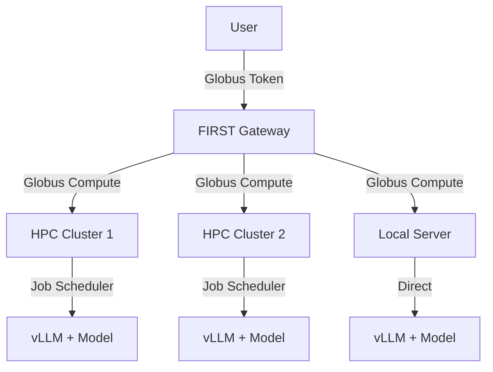

# Globus Compute + vLLM Setup

This guide shows you how to deploy vLLM on HPC clusters or remote servers using Globus Compute for federated inference.

## Overview

This is the recommended approach for:

- Multi-cluster federated deployments
- HPC environments with job schedulers (PBS, Slurm)
- Organizations requiring high availability
- Remote execution with secure authentication

## Architecture



## Prerequisites

- FIRST Gateway deployed with [Globus project and applications](../gateway-setup/globus-setup.md) ready
- Access to compute resources (HPC cluster or powerful workstation)
- GPU resources for running models
- Python 3.12+ (same version as gateway)

## Part 1: Setup on Compute Resource

This is done on the machine(s) where models will run.

### Step 1: Create Python Environment

!!! warning "Version Match"
    Use the **same Python version** as your gateway to avoid compatibility issues.

```bash
# Using conda (recommended for HPC)
conda create -n vllm-env python=3.12 -y
conda activate vllm-env

# OR using venv
python3.12 -m venv vllm-env
source vllm-env/bin/activate
```

### Step 2: Install vLLM

```bash
# For CUDA 12.1 (default)
pip install vllm

# For specific CUDA version
pip install vllm-cu118  # CUDA 11.8

# From source (for latest features)
git clone https://github.com/vllm-project/vllm.git
cd vllm
pip install -e .
```

### Step 3: Install Globus Compute

```bash
pip install globus-compute-sdk globus-compute-endpoint
```

### Step 4: Export Globus Service Account Credentials

These are from your Gateway's Service Account application:

```bash
export GLOBUS_COMPUTE_CLIENT_ID="<SERVICE_ACCOUNT_ID-from-gateway-.env>"
export GLOBUS_COMPUTE_CLIENT_SECRET="<SERVICE_ACCOUNT_SECRET-from-gateway-.env>"
```

Add to your `~/.bashrc` or `~/.bash_profile` for persistence:

```bash
echo 'export GLOBUS_COMPUTE_CLIENT_ID="your-id"' >> ~/.bashrc
echo 'export GLOBUS_COMPUTE_CLIENT_SECRET="your-secret"' >> ~/.bashrc
```

### Step 5: Register Globus Compute Functions

Navigate to the gateway repository's compute-functions directory:

```bash
cd /path/to/inference-gateway/compute-functions
```

#### Register Inference Function

```bash
python vllm_register_function_with_streaming.py
```

Output:

```
Function registered with UUID: 12345678-1234-1234-1234-123456789abc
The UUID is stored in vllm_register_function_streaming.txt
```

**Save this Function UUID** - you'll need it later.

#### Register Status Function (Optional but Recommended)

For HPC clusters with job schedulers, you can register a qstat function to monitor cluster status.

```bash
python qstat_register_function.py
```

Save the Function UUID from the output.

**Configure a qstat endpoint** on your HPC login node:

```bash
globus-compute-endpoint configure qstat-endpoint
```

Edit `~/.globus_compute/qstat-endpoint/config.yaml`:

```yaml
display_name: qstat-parser-endpoint
engine:
  type: GlobusComputeEngine
  max_retries_on_system_failure: 2
  max_workers_per_node: 2
  provider:
    type: LocalProvider
    init_blocks: 1
    max_blocks: 1
    min_blocks: 1

allowed_functions:
  - <qstat-function-uuid>  # UUID from qstat_register_function.py
```

Start the qstat endpoint:

```bash
globus-compute-endpoint start qstat-endpoint
```

Add the qstat endpoint configuration to your gateway's `.env`:

```dotenv
SOPHIA_QSTAT_ENDPOINT_UUID="<qstat-endpoint-uuid>"
SOPHIA_QSTAT_FUNCTION_UUID="<qstat-function-uuid>"
```

#### Register Batch Function (Optional)

For batch processing support:

```bash
python vllm_batch_function.py
```

Save the Function UUID.

### Step 6: Configure Globus Compute Endpoint for Inference

Create a new endpoint:

```bash
globus-compute-endpoint configure my-inference-endpoint
```

This creates `~/.globus_compute/my-inference-endpoint/config.yaml`.

#### For Local/Workstation Deployment

Edit `config.yaml`:

```yaml
display_name: My Inference Endpoint
engine:
  type: GlobusComputeEngine
  provider:
    type: LocalProvider
    init_blocks: 1
    max_blocks: 1
    min_blocks: 0
    # Activate your environment and start vLLM server
    worker_init: |
      source /path/to/vllm-env/bin/activate
      # OR: conda activate vllm-env
      
      # Start vLLM server in background
      nohup vllm serve facebook/opt-125m \
        --host 0.0.0.0 \
        --port 8000 \
        --gpu-memory-utilization 0.9 \
        > vllm.log 2>&1 &
      
      # Wait for server to be ready
      sleep 30

# Allow only your registered functions
allowed_functions:
  - 12345678-1234-1234-1234-123456789abc  # Your vLLM function UUID
```

#### For HPC with PBS (e.g., ALCF Sophia)

```yaml
display_name: Sophia vLLM Endpoint
engine:
  type: GlobusComputeEngine
  provider:
    type: PBSProProvider
    account: YourProjectAccount
    queue: demand
    nodes_per_block: 1
    init_blocks: 1
    max_blocks: 4
    min_blocks: 0
    walltime: "06:00:00"
    scheduler_options: |
      #PBS -l filesystems=home:eagle
      #PBS -l place=scatter
    worker_init: |
      module load conda
      conda activate /path/to/vllm-env
      
      # Start vLLM server in background
      nohup vllm serve facebook/opt-125m \
        --host 0.0.0.0 \
        --port 8000 \
        --tensor-parallel-size 1 \
        --gpu-memory-utilization 0.9 \
        > vllm.log 2>&1 &
      
      # Wait for server to be ready
      sleep 30

# GPU allocation
max_workers_per_node: 1

# Allow only your registered functions
allowed_functions:
  - 12345678-1234-1234-1234-123456789abc
```

!!! note "Advanced Configuration Examples from ALCF Sophia Cluster"
    For production deployments with advanced features, see the example configurations in `compute-endpoints/`. These examples are based on our deployment at **Argonne Leadership Computing Facility (ALCF) Sophia cluster** and should be adapted to your specific HPC environment:
    
    **Configuration Files:**
    
    - `sophia-vllm-singlenode-example.yaml` - Single-node deployment with optimized settings
    - `sophia-vllm-multinode-example.yaml` - Multi-node deployment for large models (70B+)
    - `sophia-vllm-toolcalling-example.yaml` - Configuration with tool calling support
    - `pbs-qstat-example.yaml` - PBS job scheduler monitoring endpoint
    
    **Helper Scripts:**
    
    - `launch_vllm_model.sh` - Modular vLLM launcher with automatic Ray setup, retry logic, and health monitoring
    - `sophia_env_setup_with_ray.sh` - Environment setup script for ALCF Sophia (loads modules, conda envs, sets proxy, configures Ray)
    
    These examples demonstrate a production-ready setup with:
    
    - Dynamic vLLM version selection
    - Multi-node Ray cluster management
    - Advanced vLLM parameters (chunked prefill, prefix caching, tool calling)
    - Comprehensive logging and error handling
    - Retry logic with timeout management
    
    !!! warning "Cluster-Specific Adaptation Required"
        The Sophia scripts are **specific to ALCF infrastructure** and must be adapted for your cluster:
        
        - Module names and paths
        - Conda environment locations
        - File system paths (e.g., `/eagle/argonne_tpc/`)
        - Proxy settings
        - Network interface names (e.g., `infinibond0`, `ens10f0`)
        - Job scheduler options and queue names
        - SSL certificate paths
        
        Use these as **templates** to create your own cluster-specific scripts.

#### For HPC with Slurm

```yaml
display_name: Slurm vLLM Endpoint
engine:
  type: GlobusComputeEngine
  provider:
    type: SlurmProvider
    account: your_account
    partition: gpu
    nodes_per_block: 1
    init_blocks: 1
    max_blocks: 4
    walltime: "06:00:00"
    scheduler_options: |
      #SBATCH --gpus-per-node=1
      #SBATCH --mem=64G
    worker_init: |
      source /path/to/vllm-env/bin/activate
      
      # Start vLLM server in background
      nohup vllm serve facebook/opt-125m \
        --host 0.0.0.0 \
        --port 8000 \
        --gpu-memory-utilization 0.9 \
        > vllm.log 2>&1 &
      
      # Wait for server to be ready
      sleep 30

allowed_functions:
  - 12345678-1234-1234-1234-123456789abc
```

### Step 7: Start the Endpoint

```bash
globus-compute-endpoint start my-inference-endpoint
```

Output:

```
Starting endpoint; registered ID: abcdef12-3456-7890-abcd-ef1234567890
```

**Save this Endpoint UUID** - you'll need it for gateway configuration.

Verify it's running:

```bash
globus-compute-endpoint list
```

View logs:

```bash
globus-compute-endpoint log my-inference-endpoint
```

### Step 8: Test the Endpoint

Once your endpoint is running, the following python script will test whether your endpoint can be integrated with the Gateway API. Make sure you incorporate your Globus IDs and secret.
```python
from globus_compute_sdk import Client, Executor
from globus_sdk import ClientApp

# Credentials and UUIDs
GLOBUS_SERVICE_ACCOUNT_ID="add-your-globus-service-account-uuid-here"
GLOBUS_SERVICE_ACCOUNT_SECRET="add-your-globus-service-account-secret-here"
GLOBUS_COMPUTE_ENDPOINT_ID="add-your-compute-endpoint-uuid-here"
GLOBUS_COMPUTE_FUNCTION_ID="add-your-compute-function-uuid-here"

# Create a Globus SDK client authenticated as your Globus service account
client_app = ClientApp(
    client_id=GLOBUS_SERVICE_ACCOUNT_ID,
    client_secret=GLOBUS_SERVICE_ACCOUNT_SECRET
)

# Create a Globus Compute SDK client
compute_client = Client(
    app=client_app
)

# Create a Globus Compute SDK Executor for your targetted endpoint
compute_executor = Executor(
    client=compute_client, 
    endpoint_id=GLOBUS_COMPUTE_ENDPOINT_ID
)

# Build a test query data for the function
# Customize to your need (e.g. change model, api_port, and openai_endpoint if needed)
data = {
    "model_params": {
        "openai_endpoint": "chat/completions",
        "api_port": 8000,
        "model": "facebook/opt-125m",
        "messages": [{"role": "user", "content": [{"type": "text", "text": "Are you working?"}]}],
    }
}

# Submit your query to the compute endpoint
future = compute_executor.submit_to_registered_function(GLOBUS_COMPUTE_FUNCTION_ID, args=[data])

# Wait for the result and print it
future.result()
```

The first response will take some time since your endpoint will acquire the compute resource and load the LLM weight into memory. In production, this cold-start time can be lifted if compute nodes are persistently dedicated to inference.

---

## ALCF Sophia Production Example

This section shows how we deploy vLLM at **Argonne Leadership Computing Facility (ALCF)** on the Sophia cluster. These are production examples that you should adapt to your own HPC environment.

### Architecture Overview

Our production setup uses a modular approach:

1. **Environment Setup Script** (`sophia_env_setup_with_ray.sh`) - Manages conda environments, modules, Ray cluster setup
2. **Model Launcher** (`launch_vllm_model.sh`) - Flexible vLLM launcher with multi-node support
3. **Endpoint Configurations** (YAML files) - PBS-specific settings for different model sizes

### Environment Setup Script

The `sophia_env_setup_with_ray.sh` provides:

- **Dynamic version selection**: Automatically loads correct conda environment based on `VLLM_VERSION`
- **Module management**: Loads ALCF-specific modules (conda, gcc, spack)
- **Proxy configuration**: Sets up HTTP/HTTPS proxies for ALCF network
- **Ray cluster management**: Automated multi-node Ray setup for pipeline parallelism
- **Retry logic**: Robust model startup with monitoring and timeout handling

**Key Functions:**

```bash
# Load the script (done automatically by launch_vllm_model.sh)
source /home/openinference_svc/sophia_env_setup_with_ray.sh

# Setup conda environment and exports
setup_environment

# Setup multi-node Ray cluster (for large models)
setup_ray_cluster

# Start model with retry logic
start_model "model-name" "vllm serve ..." "logfile.log" retry_counter 2 3600

# Cleanup processes
cleanup_python_processes

# Stop Ray
stop_ray
```

### Model Launcher Script

The `launch_vllm_model.sh` provides a unified interface for launching models:

```bash
# Single-node example (8 GPUs, tensor parallelism)
source /home/openinference_svc/launch_vllm_model.sh \
  --model-name meta-llama/Meta-Llama-3.1-8B-Instruct \
  --vllm-version v0.11.0 \
  --tensor-parallel 8 \
  --max-model-len 8192 \
  --enable-chunked-prefill \
  --enable-prefix-caching \
  --trust-remote-code \
  --gpu-memory-util 0.95 \
  --framework vllm \
  --cluster sophia

# Multi-node example (4 nodes, 32 GPUs, TP=8 PP=4)
source /home/openinference_svc/launch_vllm_model.sh \
  --model-name meta-llama/Meta-Llama-3.1-405B-Instruct \
  --vllm-version v0.11.0 \
  --tensor-parallel 8 \
  --pipeline-parallel 4 \
  --max-model-len 16384 \
  --enable-prefix-caching \
  --gpu-memory-util 0.95
```

**The launcher automatically:**

- Sources `sophia_env_setup_with_ray.sh`
- Calls `setup_environment()`
- Detects single vs multi-node based on `--pipeline-parallel` or `--multi` flag
- Sets up Ray cluster if needed
- Builds and executes vLLM command
- Monitors startup with retry logic
- Handles errors and logging

### Example Endpoint Configurations

#### Single-Node (8 GPUs)

From `sophia-vllm-singlenode-example.yaml`:

```yaml
display_name: sophia-vllm-llama3.1-8b-instruct
engine:
  type: GlobusComputeEngine
  provider:
    type: PBSProProvider
    account: argonne_tpc
    select_options: ngpus=8
    queue: 'by-node'
    nodes_per_block: 1
    max_blocks: 2
    walltime: 24:00:00
    scheduler_options: '#PBS -l filesystems=home:eagle'
    worker_init: |
      # Use the modular launcher script
      source /home/openinference_svc/launch_vllm_model.sh \
        --model-name meta-llama/Meta-Llama-3.1-8B-Instruct \
        --vllm-version v0.11.0 \
        --tensor-parallel 8 \
        --max-model-len 8192 \
        --enable-chunked-prefill \
        --enable-prefix-caching \
        --trust-remote-code \
        --gpu-memory-util 0.95 \
        --framework vllm \
        --cluster sophia

allowed_functions:
  - <your-vllm-function-uuid>  # Replace with your function UUID
```

#### Multi-Node (4 nodes, 32 GPUs)

From `sophia-vllm-multinode-example.yaml`:

```yaml
display_name: sophia-vllm-llama3.1-405b-instruct
engine:
  type: GlobusComputeEngine
  provider:
    type: PBSProProvider
    account: argonne_tpc
    select_options: ngpus=8
    queue: 'by-node'
    nodes_per_block: 4  # 4 nodes
    walltime: 24:00:00
    scheduler_options: '#PBS -l filesystems=home:eagle'
    worker_init: |
      # Multi-node with pipeline parallelism (requires Ray)
      source /home/openinference_svc/launch_vllm_model.sh \
        --model-name meta-llama/Meta-Llama-3.1-405B-Instruct \
        --vllm-version v0.11.0 \
        --tensor-parallel 8 \
        --pipeline-parallel 4 \
        --max-model-len 16384 \
        --enable-prefix-caching \
        --enable-chunked-prefill \
        --trust-remote-code \
        --gpu-memory-util 0.95 \
        --framework vllm \
        --cluster sophia

allowed_functions:
  - <your-vllm-function-uuid>  # Replace with your function UUID
```

### Adapting for Your Cluster

To adapt these scripts for your HPC environment:

#### 1. Create Your Environment Setup Script

Copy `sophia_env_setup_with_ray.sh` and modify:

```bash
# Change proxy settings (or remove if not needed)
export HTTP_PROXY="your-proxy:port"

# Change module loading
module use /your/module/path
module load your-conda-module

# Change conda environment paths
case "$VLLM_VERSION" in
    v0.11.0)
        CONDA_ENV="/your/path/to/vllm-env/"
        ;;
esac

# Change HuggingFace cache paths
export HF_HOME='/your/model/cache/path/'

# Change network interface for NCCL (check with `ifconfig`)
export NCCL_SOCKET_IFNAME='your-network-interface'  # e.g., 'ib0', 'eth0'

# Adjust Ray node resources
export RAY_NUM_CPUS=64  # CPUs per node
export RAY_NUM_GPUS=8   # GPUs per node
```

#### 2. Adapt the Launcher Script (Optional)

The `launch_vllm_model.sh` is fairly generic, but you may need to:

- Update the default environment setup script path (line 242)
- Adjust SSL certificate paths if using HTTPS
- Modify default values for your hardware

#### 3. Update Endpoint YAML

```yaml
# Change PBS/Slurm provider settings
provider:
  type: PBSProProvider  # or SlurmProvider
  account: your_project_account
  queue: your_queue_name
  scheduler_options: |
    #PBS -l your:scheduler:options
    # Adjust for your cluster's requirements

# Update worker_init paths
worker_init: |
  source /your/path/to/your_env_setup.sh \
    --model-name your/model \
    --your-specific-flags

# Adjust resource allocation
select_options: ngpus=4  # GPUs per node
nodes_per_block: 1       # Nodes per job
max_workers_per_node: 1  # Workers per node
```

#### 4. Key Cluster-Specific Items to Check

| Item | ALCF Sophia Example | What to Change |
|------|---------------------|----------------|
| Network Interface | `infinibond0`, `ens10f0` | Run `ifconfig` on compute node |
| File System | `/eagle/argonne_tpc/` | Your shared file system path |
| Module System | `module use /soft/modulefiles` | Your cluster's module path |
| Conda Path | `/eagle/argonne_tpc/inference-gateway/envs/` | Your conda env location |
| Proxy | `http://proxy.alcf.anl.gov:3128` | Your proxy or remove |
| SSL Certs | `~/certificates/mykey.key` | Your SSL cert path or disable |
| PBS Options | `#PBS -l filesystems=home:eagle` | Your scheduler requirements |
| Queue Name | `by-node`, `demand` | Your cluster's queue names |

### Troubleshooting ALCF Sophia Examples

Common issues when adapting:

**Module not found:**
```bash
# Check available modules
module avail

# Update module paths in your env setup script
module use /correct/module/path
```

**Conda environment not activating:**
```bash
# Verify conda init
conda init bash
source ~/.bashrc

# Check environment exists
conda env list

# Update paths in setup_environment() function
```

**NCCL network errors:**
```bash
# Check network interfaces
ifconfig

# Update NCCL_SOCKET_IFNAME in env setup script
export NCCL_SOCKET_IFNAME='correct-interface-name'
```

**Ray cluster not starting:**
```bash
# Check PBS nodefile exists
echo $PBS_NODEFILE
cat $PBS_NODEFILE

# Verify nodes can communicate
mpiexec -n 2 hostname

# Check Ray ports are open (default 6379)
```

---

## Part 2: Configure Gateway

Now configure the gateway to use your Globus Compute endpoint.

### Step 1: Create Endpoint Fixture

On your gateway machine, edit `fixtures/endpoints.json`:

#### Single Endpoint Configuration

```json
[
    {
        "model": "resource_server.endpoint",
        "pk": 1,
        "fields": {
            "endpoint_slug": "local-vllm-opt-125m",
            "cluster": "local",
            "framework": "vllm",
            "model": "facebook/opt-125m",
            "api_port": 8000,
            "endpoint_uuid": "abcdef12-3456-7890-abcd-ef1234567890",
            "function_uuid": "12345678-1234-1234-1234-123456789abc",
            "batch_endpoint_uuid": "",
            "batch_function_uuid": "",
            "allowed_globus_groups": ""
        }
    }
]
```

#### Multiple Clusters Configuration

```json
[
    {
        "model": "resource_server.endpoint",
        "pk": 1,
        "fields": {
            "endpoint_slug": "local-vllm-opt-125m",
            "cluster": "local",
            "framework": "vllm",
            "model": "facebook/opt-125m",
            "api_port": 8000,
            "endpoint_uuid": "local-endpoint-uuid",
            "function_uuid": "local-function-uuid",
            "allowed_globus_groups": ""
        }
    },
    {
        "model": "resource_server.endpoint",
        "pk": 2,
        "fields": {
            "endpoint_slug": "sophia-vllm-opt-125m",
            "cluster": "sophia",
            "framework": "vllm",
            "model": "facebook/opt-125m",
            "api_port": 8000,
            "endpoint_uuid": "sophia-endpoint-uuid",
            "function_uuid": "sophia-function-uuid",
            "allowed_globus_groups": ""
        }
    }
]
```

### Step 2: Federated Endpoints (Optional but Recommended)

For automatic load balancing and failover, use federated endpoints.

Edit `fixtures/federated_endpoints.json`:

```json
[
    {
        "model": "resource_server.federatedendpoint",
        "pk": 1,
        "fields": {
            "name": "OPT-125M (Federated)",
            "slug": "federated-opt-125m",
            "target_model_name": "facebook/opt-125m",
            "description": "Federated access to OPT-125M across multiple clusters",
            "targets": [
                {
                    "cluster": "local",
                    "framework": "vllm",
                    "model": "facebook/opt-125m",
                    "endpoint_slug": "local-vllm-opt-125m",
                    "endpoint_uuid": "local-endpoint-uuid",
                    "function_uuid": "local-function-uuid",
                    "api_port": 8000
                },
                {
                    "cluster": "sophia",
                    "framework": "vllm",
                    "model": "facebook/opt-125m",
                    "endpoint_slug": "sophia-vllm-opt-125m",
                    "endpoint_uuid": "sophia-endpoint-uuid",
                    "function_uuid": "sophia-function-uuid",
                    "api_port": 8000
                }
            ]
        }
    }
]
```

### Step 3: Load Fixtures

```bash
# Docker
docker-compose exec inference-gateway python manage.py loaddata fixtures/endpoints.json
docker-compose exec inference-gateway python manage.py loaddata fixtures/federated_endpoints.json

# Bare Metal
python manage.py loaddata fixtures/endpoints.json
python manage.py loaddata fixtures/federated_endpoints.json
```

## Part 3: Testing

### Test Globus Compute Endpoint

From your gateway machine, test that you can reach the endpoint:

```python
from globus_compute_sdk import Client

gcc = Client()
endpoint_id = "abcdef12-3456-7890-abcd-ef1234567890"
function_id = "12345678-1234-1234-1234-123456789abc"

# Simple test function
def hello():
    return "Hello from Globus Compute!"

# Register and run
func_uuid = gcc.register_function(hello)
task = gcc.run(endpoint_id=endpoint_id, function_id=func_uuid)
print(gcc.get_result(task))
```

### Test vLLM via Gateway

First, download the authentication helper script:

```bash
# Download the authentication helper script
wget https://raw.githubusercontent.com/argonne-lcf/inference-endpoints/refs/heads/main/inference_auth_token.py

# Authenticate with your Globus account
python inference_auth_token.py authenticate
```

Get a Globus token:

```bash
export TOKEN=$(python inference_auth_token.py get_access_token)
```

Test non-federated endpoint:

```bash
curl -X POST http://localhost:8000/resource_server/local/vllm/v1/chat/completions \
  -H "Authorization: Bearer $TOKEN" \
  -H "Content-Type: application/json" \
  -d '{
    "model": "facebook/opt-125m",
    "messages": [{"role": "user", "content": "What is Globus Compute?"}],
    "max_tokens": 100
  }'
```

Test federated endpoint:

```bash
curl -X POST http://localhost:8000/resource_server/v1/chat/completions \
  -H "Authorization: Bearer $TOKEN" \
  -H "Content-Type: application/json" \
  -d '{
    "model": "facebook/opt-125m",
    "messages": [{"role": "user", "content": "What is Globus Compute?"}],
    "max_tokens": 100
  }'
```

## Advanced Configuration

### Hot Nodes / Keep-Alive

For low-latency inference, keep compute nodes warm:

```yaml
# In config.yaml
engine:
  provider:
    min_blocks: 1  # Always keep 1 node running
    init_blocks: 1  # Start with 1 node
```

### Multi-Node vLLM

For very large models (70B+), use tensor parallelism across multiple GPUs/nodes:

See `compute-endpoints/sophia-vllm-multinode-example.yaml` for configuration examples.

### Custom Inference Scripts

The registered functions use scripts in `compute-functions/`. You can customize:

- `launch_vllm_model.sh`: How vLLM is started
- `vllm_register_function_with_streaming.py`: The inference function logic

### Batch Processing

Enable batch processing by registering and configuring batch functions:

```bash
python vllm_batch_function.py
```

Add batch UUIDs to your endpoint fixture:

```json
{
    "batch_endpoint_uuid": "batch-endpoint-uuid",
    "batch_function_uuid": "batch-function-uuid"
}
```

## Monitoring

### Endpoint Status

```bash
# Check endpoint status
globus-compute-endpoint status my-inference-endpoint

# View Globus Compute endpoint logs
tail -f ~/.globus_compute/my-inference-endpoint/endpoint.log

# Check task submission logs
ls -la ~/.globus_compute/my-inference-endpoint/submit_tasks/
tail -f ~/.globus_compute/my-inference-endpoint/submit_tasks/*.submit.log

# View vLLM server logs (from worker_init nohup)
tail -f vllm.log
```

### Job Scheduler Monitoring

```bash
# PBS
qstat -u $USER

# Slurm
squeue -u $USER
```

### Gateway Logs

```bash
# Docker
docker-compose logs -f inference-gateway

# Bare Metal
tail -f logs/django_info.log
```

## Troubleshooting

### Endpoint won't start

Check logs:

```bash
globus-compute-endpoint log my-inference-endpoint
```

Common issues:

- Service account credentials not set
- Function UUIDs not in `allowed_functions`
- Python environment activation fails
- Job scheduler configuration incorrect

### Function execution fails

- Verify environment can run vLLM: Test manually on compute node
- Check function is allowed in `config.yaml`
- Ensure Service Account has permissions
- Check job scheduler logs

### Model not loading

- Verify GPU allocation in scheduler options
- Check VRAM requirements
- Ensure model path/name is correct
- Check Hugging Face token if needed

### Gateway can't connect

- Verify endpoint is running: `globus-compute-endpoint list`
- Check endpoint UUID in fixtures is correct
- Ensure Service Account credentials match in both places
- Check network connectivity (firewall, VPN)

## HPC-Specific Considerations

### ALCF Systems (Polaris, Sophia)

- Use `/lus/eagle` for model cache
- Load CUDA modules in `worker_init`
- Set appropriate walltime
- Use `#PBS -l filesystems=home:eagle`

### Other HPC Centers

- Check local documentation for:
  - GPU allocation syntax
  - File system paths
  - Module system
  - Queue/partition names
  - Accounting project codes

## Scaling

### Auto-Scaling

Configure `max_blocks` to allow automatic scaling:

```yaml
engine:
  provider:
    init_blocks: 1
    min_blocks: 1
    max_blocks: 10  # Scale up to 10 nodes
```

### Load Balancing

Federated endpoints automatically load balance across all "Live" targets.

### Geographic Distribution

Deploy endpoints at different locations and configure federated routing for optimal latency.

## Security

### Function Allowlisting

Always specify `allowed_functions` in `config.yaml`:

```yaml
allowed_functions:
  - 12345678-1234-1234-1234-123456789abc  # Only your functions
```

### Group-Based Access

Restrict endpoints to specific Globus groups:

```json
{
    "allowed_globus_groups": "group-uuid-1,group-uuid-2"
}
```

### Network Security

- Globus Compute uses HTTPS and mutual TLS
- No inbound ports need to be opened on compute resources
- All communication is outbound from endpoint to Globus services

## Next Steps

- [Production Best Practices](../deployment/production.md)
- [Monitoring & Troubleshooting](../monitoring.md)
- [User Guide](../../user-guide/index.md)

## Additional Resources

- [Globus Compute Documentation](https://globus-compute.readthedocs.io/)
- [vLLM Documentation](https://docs.vllm.ai/)
- [Example Configurations](../../../compute-endpoints/)
- [Function Registration Scripts](../../../compute-functions/)

