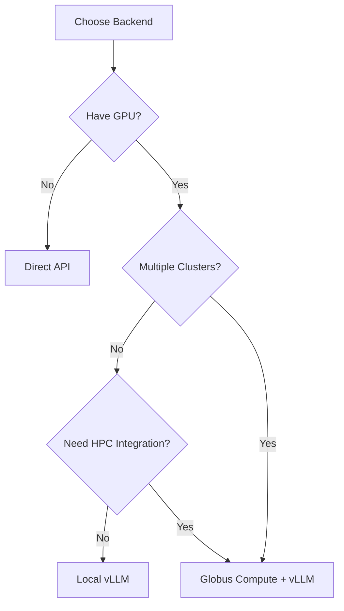

# Inference Backend Setup

The FIRST Inference Gateway supports multiple types of inference backends. Choose the approach that best fits your use case.

## Backend Options

### 1. Globus Compute + vLLM (Recommended)

Deploy vLLM on HPC clusters or multiple servers with Globus Compute for remote execution and federated routing.

**Best for:**

- Multi-cluster deployments
- HPC environments
- Federated inference across organizations
- Production deployments requiring high availability

**Pros:**

- Federated routing across clusters
- Automatic failover
- HPC job scheduler integration
- Scales across organizations
- Secure, authenticated remote execution

**Cons:**

- More complex setup
- Requires Globus Compute knowledge
- Additional configuration overhead

[→ Setup Globus Compute + vLLM](globus-compute.md)

---

### 2. Local vLLM Setup

Run vLLM inference server locally without Globus Compute.

**Best for:**

- Single-server deployments
- Development and testing with local models
- Controlled environments where Globus Compute isn't needed
- Simple architectures

**Pros:**

- Full control over models and data
- No external dependencies
- Simple architecture
- Lower latency for local requests

**Cons:**

- Requires GPU resources
- Single point of failure
- Manual scaling
- No federated routing

[→ Setup Local vLLM](local-vllm.md)

---

### 3. Direct API Connection

Connect to existing OpenAI-compatible APIs without any local inference infrastructure.

**Best for:**

- Quick testing and development
- Using commercial API services (OpenAI, Anthropic, etc.)
- Organizations without GPU resources
- Proxying/adding authentication to existing APIs

**Pros:**

- Fastest setup (5-10 minutes)
- No local compute resources needed
- Scales with the provider
- Multiple models immediately available

**Cons:**

- Costs per API call
- Data leaves your infrastructure
- Dependent on third-party service

[→ Setup Direct API Connection](direct-api.md)

---

## Comparison Matrix

| Feature | Globus Compute + vLLM | Local vLLM | Direct API |
|---------|----------------------|------------|------------|
| Setup Time | 2-4 hours | 30-60 min | 5-10 min |
| GPU Required | Yes | Yes | No |
| Data Privacy | Local | Local | External |
| Multi-Cluster | Yes | No | No |
| Failover | Automatic | Manual | Provider |
| Cost | Infrastructure | Infrastructure | Pay-per-use |
| HPC Integration | Yes | No | No |
| Complexity | High | Medium | Low |

## Decision Tree



## Combined Approach

You can use multiple backends simultaneously! The gateway supports:

- **Multiple Direct API connections**: Route to OpenAI, Anthropic, etc.
- **Mix Local and Remote**: Some models local, some via Globus Compute
- **Federated Endpoints**: Route same model across multiple clusters

Example combined setup:

```json
{
  "endpoints": [
    {
      "cluster": "openai",
      "model": "gpt-4",
      "type": "direct_api"
    },
    {
      "cluster": "local",
      "model": "llama-3-8b",
      "type": "vllm"
    },
    {
      "cluster": "sophia",
      "model": "llama-3-70b",
      "type": "globus_compute"
    }
  ]
}
```

## Prerequisites by Backend Type

### All Backends

- FIRST Gateway already deployed
- Access to gateway configuration
- Admin access to load fixtures

### Direct API

- API keys from providers
- Status manifest endpoint (can be static file)

### Local vLLM

- GPU with sufficient VRAM for your model
- Python 3.12+
- Ability to run vLLM server

### Globus Compute + vLLM

- All Local vLLM requirements plus:
- Globus Service Account application
- Access to HPC cluster (optional)
- Ability to configure Globus Compute endpoints

## Setup Workflow

### Phase 1: Choose and Setup Backend

Follow the guide for your chosen backend type.

### Phase 2: Register with Gateway

Update fixture files (`fixtures/endpoints.json` or `fixtures/federated_endpoints.json`) with your backend details.

### Phase 3: Load Configuration

```bash
# Docker
docker-compose exec inference-gateway python manage.py loaddata fixtures/endpoints.json

# Bare metal
python manage.py loaddata fixtures/endpoints.json
```

### Phase 4: Test

Send a test request to verify the connection:

```bash
curl -X POST http://localhost:8000/resource_server/v1/chat/completions \
  -H "Authorization: Bearer $TOKEN" \
  -H "Content-Type: application/json" \
  -d '{
    "model": "your-model-name",
    "messages": [{"role": "user", "content": "Hello!"}]
  }'
```

## Next Steps

Choose your backend setup guide:

- [Globus Compute + vLLM](globus-compute.md) _(Recommended for Production)_
- [Local vLLM Setup](local-vllm.md)
- [Direct API Connection](direct-api.md)

After setup:

- [Production Best Practices](../deployment/production.md)
- [Monitoring & Troubleshooting](../monitoring.md)

