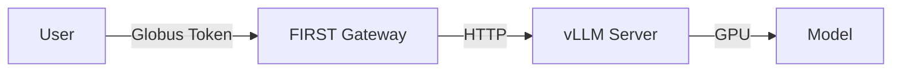

# Local vLLM Setup

This guide shows you how to run vLLM inference server locally and connect it to the FIRST Gateway **without** Globus Compute.

## Overview

This setup is ideal for:

- Single-server deployments
- Development and testing
- Scenarios where Globus Compute overhead isn't needed
- Direct control over the inference process

## Architecture



## Prerequisites

- NVIDIA GPU with sufficient VRAM for your model
- CUDA 11.8 or later
- Python 3.12+
- Docker (optional, for containerized vLLM)

## Step 1: Install vLLM

### Option A: Install from Source (Recommended)

```bash
# Create virtual environment
python3.12 -m venv vllm-env
source vllm-env/bin/activate

# Clone and install vLLM
git clone https://github.com/vllm-project/vllm.git
cd vllm
pip install -e .

# Install additional dependencies
pip install openai  # For testing
```

### Option B: Install via pip

```bash
python3.12 -m venv vllm-env
source vllm-env/bin/activate

pip install vllm

# For specific CUDA version
pip install vllm  # CUDA 12.1 by default
# OR
pip install vllm-cu118  # For CUDA 11.8
```

### Option C: Use Docker

```bash
docker pull vllm/vllm-openai:latest
```

## Step 2: Download a Model

Choose a model based on your GPU VRAM:

| Model | VRAM Required | Performance |
|-------|---------------|-------------|
| facebook/opt-125m | ~1GB | Fast, good for testing |
| meta-llama/Llama-2-7b-chat-hf | ~14GB | Good quality |
| meta-llama/Meta-Llama-3-8B-Instruct | ~16GB | Better quality |
| meta-llama/Llama-2-13b-chat-hf | ~26GB | High quality |
| meta-llama/Llama-2-70b-chat-hf | ~140GB | Best quality (multi-GPU) |

### Using Hugging Face

```bash
# Login to Hugging Face (for gated models like Llama)
pip install huggingface-hub
huggingface-cli login

# Models will auto-download on first use
# Or pre-download:
huggingface-cli download meta-llama/Meta-Llama-3-8B-Instruct
```

## Step 3: Start vLLM Server

### Basic Start

```bash
source vllm-env/bin/activate

python -m vllm.entrypoints.openai.api_server \
    --model facebook/opt-125m \
    --host 0.0.0.0 \
    --port 8001
```

### Production Configuration

```bash
python -m vllm.entrypoints.openai.api_server \
    --model meta-llama/Meta-Llama-3-8B-Instruct \
    --host 0.0.0.0 \
    --port 8001 \
    --tensor-parallel-size 1 \
    --gpu-memory-utilization 0.9 \
    --max-model-len 4096 \
    --dtype auto \
    --enable-prefix-caching
```

### Multi-GPU Configuration

```bash
# For 4 GPUs
python -m vllm.entrypoints.openai.api_server \
    --model meta-llama/Llama-2-70b-chat-hf \
    --host 0.0.0.0 \
    --port 8001 \
    --tensor-parallel-size 4 \
    --gpu-memory-utilization 0.9
```

### Using Docker

```bash
docker run --gpus all \
    -v ~/.cache/huggingface:/root/.cache/huggingface \
    -p 8001:8000 \
    --env "HUGGING_FACE_HUB_TOKEN=<your_token>" \
    vllm/vllm-openai:latest \
    --model facebook/opt-125m \
    --host 0.0.0.0 \
    --port 8000
```

## Step 4: Test vLLM Server

```bash
curl http://localhost:8001/v1/chat/completions \
    -H "Content-Type: application/json" \
    -d '{
        "model": "facebook/opt-125m",
        "messages": [
            {"role": "user", "content": "Hello!"}
        ]
    }'
```

## Step 5: Create systemd Service (Optional)

For production deployments, run vLLM as a system service:

```bash
sudo nano /etc/systemd/system/vllm.service
```

Add:

```ini
[Unit]
Description=vLLM Inference Server
After=network.target

[Service]
Type=simple
User=your-username
WorkingDirectory=/home/your-username
Environment="PATH=/home/your-username/vllm-env/bin"
ExecStart=/home/your-username/vllm-env/bin/python -m vllm.entrypoints.openai.api_server \
    --model meta-llama/Meta-Llama-3-8B-Instruct \
    --host 0.0.0.0 \
    --port 8001 \
    --tensor-parallel-size 1 \
    --gpu-memory-utilization 0.9
Restart=always
RestartSec=10

[Install]
WantedBy=multi-user.target
```

Enable and start:

```bash
sudo systemctl daemon-reload
sudo systemctl enable vllm
sudo systemctl start vllm
sudo systemctl status vllm
```

## Step 6: Configure Gateway

### Update Gateway Environment

Edit your gateway's `.env`:

```dotenv
# Add if using local vLLM without Globus Compute
LOCAL_VLLM_URL="http://localhost:8001"
```

### Create Endpoint Fixture

Create or edit `fixtures/endpoints.json` in your gateway directory:

```json
[
    {
        "model": "resource_server.endpoint",
        "pk": 1,
        "fields": {
            "endpoint_slug": "local-vllm-opt-125m",
            "cluster": "local",
            "framework": "vllm",
            "model": "facebook/opt-125m",
            "api_port": 8001,
            "endpoint_uuid": "",
            "function_uuid": "",
            "batch_endpoint_uuid": "",
            "batch_function_uuid": "",
            "allowed_globus_groups": ""
        }
    }
]
```

For a Llama model:

```json
[
    {
        "model": "resource_server.endpoint",
        "pk": 2,
        "fields": {
            "endpoint_slug": "local-vllm-llama3-8b",
            "cluster": "local",
            "framework": "vllm",
            "model": "meta-llama/Meta-Llama-3-8B-Instruct",
            "api_port": 8001,
            "endpoint_uuid": "",
            "function_uuid": "",
            "batch_endpoint_uuid": "",
            "batch_function_uuid": "",
            "allowed_globus_groups": ""
        }
    }
]
```

### Load Fixture

```bash
# Docker
docker-compose exec inference-gateway python manage.py loaddata fixtures/endpoints.json

# Bare metal
python manage.py loaddata fixtures/endpoints.json
```

## Step 7: Test End-to-End

Get a Globus token:

```bash
export TOKEN=$(python inference-auth-token.py get_access_token)
```

Test via gateway:

```bash
curl -X POST http://localhost:8000/resource_server/local/vllm/v1/chat/completions \
  -H "Authorization: Bearer $TOKEN" \
  -H "Content-Type: application/json" \
  -d '{
    "model": "facebook/opt-125m",
    "messages": [{"role": "user", "content": "Explain machine learning in one sentence"}],
    "max_tokens": 50
  }'
```

## Performance Tuning

### GPU Memory Optimization

```bash
# Use less GPU memory (if OOM errors)
--gpu-memory-utilization 0.8

# Use more GPU memory (if you have headroom)
--gpu-memory-utilization 0.95
```

### Batch Processing

```bash
# Increase batch size for throughput
--max-num-batched-tokens 8192
--max-num-seqs 256
```

### Context Length

```bash
# Reduce for better throughput
--max-model-len 2048

# Increase for longer contexts
--max-model-len 8192
```

### Quantization

```bash
# Use 4-bit quantization (AWQ)
--quantization awq
--model TheBloke/Llama-2-7B-Chat-AWQ

# Use 8-bit quantization (GPTQ)
--quantization gptq
--model TheBloke/Llama-2-7B-Chat-GPTQ
```

## Monitoring

### vLLM Metrics

vLLM exposes Prometheus metrics at `http://localhost:8001/metrics`:

```bash
curl http://localhost:8001/metrics
```

### GPU Monitoring

```bash
# Watch GPU usage
watch -n 1 nvidia-smi

# More detailed stats
nvidia-smi dmon
```

### Log Monitoring

```bash
# systemd service logs
sudo journalctl -u vllm -f

# Or direct output if running in terminal
python -m vllm.entrypoints.openai.api_server ... | tee vllm.log
```

## Troubleshooting

### Out of Memory (OOM) Errors

```bash
# Reduce GPU memory usage
--gpu-memory-utilization 0.7

# Reduce context length
--max-model-len 2048

# Use quantization
--quantization awq

# Use smaller model
```

### Slow Response Times

- Check GPU utilization with `nvidia-smi`
- Increase `--gpu-memory-utilization` if GPU memory is underutilized
- Enable `--enable-prefix-caching` for repeated prompts
- Use tensor parallelism for multi-GPU setups

### Model Not Found

```bash
# Pre-download model
huggingface-cli download meta-llama/Meta-Llama-3-8B-Instruct

# Or set cache directory
export HF_HOME=/path/to/cache
```

### CUDA Errors

```bash
# Check CUDA version
nvidia-smi

# Install matching vLLM version
pip install vllm-cu118  # For CUDA 11.8
```

### Connection Refused from Gateway

- Verify vLLM is running: `curl http://localhost:8001/health`
- Check firewall settings
- Ensure correct port in fixture configuration
- Verify host is `0.0.0.0` not `localhost`

## Running Multiple Models

You can run multiple vLLM instances on different ports:

```bash
# Terminal 1 - OPT-125M
python -m vllm.entrypoints.openai.api_server \
    --model facebook/opt-125m \
    --port 8001

# Terminal 2 - Llama-2-7B
python -m vllm.entrypoints.openai.api_server \
    --model meta-llama/Llama-2-7b-chat-hf \
    --port 8002
```

Add both to your fixtures:

```json
[
    {
        "model": "resource_server.endpoint",
        "pk": 1,
        "fields": {
            "endpoint_slug": "local-vllm-opt-125m",
            "cluster": "local",
            "framework": "vllm",
            "model": "facebook/opt-125m",
            "api_port": 8001,
            ...
        }
    },
    {
        "model": "resource_server.endpoint",
        "pk": 2,
        "fields": {
            "endpoint_slug": "local-vllm-llama2-7b",
            "cluster": "local",
            "framework": "vllm",
            "model": "meta-llama/Llama-2-7b-chat-hf",
            "api_port": 8002,
            ...
        }
    }
]
```

## Next Steps

- [Production Best Practices](../deployment/production.md)
- [Monitoring Setup](../monitoring.md)
- [User Guide](../../user-guide/index.md)
- Upgrade to [Globus Compute + vLLM](globus-compute.md) for federated deployment

## Additional Resources

- [vLLM Documentation](https://docs.vllm.ai/)
- [Hugging Face Models](https://huggingface.co/models)
- [NVIDIA GPU Documentation](https://docs.nvidia.com/cuda/)

